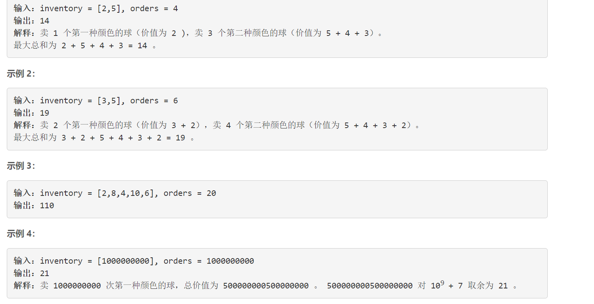

### 1648. 销售价值减少的颜色球

###     




## Java solution 

```java
class Solution {
    long mod=(long)1e9+7;
    public int maxProfit(int[] inventory, int orders) {
        int n=inventory.length;
        long[] in=new long[n];
        for(int i=0;i<n;i++)in[i]=(long)inventory[i];
        long l=0,r=(long)1e9+5; 
        long sum=0;
        long sumRange;
        while(l<r)
        {
            long mid=(l+r)>>1; 
            sum=0;
            for(int i=0;i<n;i++)
            {
                if(mid<=in[i])sum=sum+in[i]-mid+1;
                if(sum>(long)orders) break;
            }
            if(sum>(long)orders) l=mid+1;
            else r=mid;
        }
        long res=0;
        for(int i=0;i<n;i++)
        {
            if(l<=in[i])
            {
               sumRange=((in[i]-l+1)*(in[i]+l)/2)%mod; 
               res=(res+sumRange)%mod;
               orders-=(int)(in[i]-l+1);
            }
        } 
        sumRange=((l-1)*orders)%mod; 
        res=(res+sumRange)%mod;
        return (int)(res%mod);
    }
}
```

