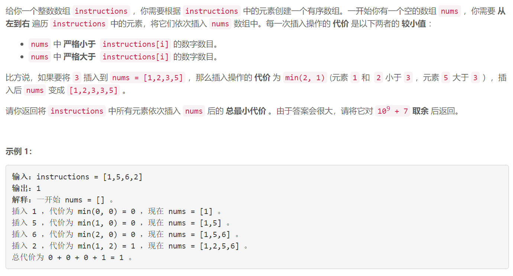
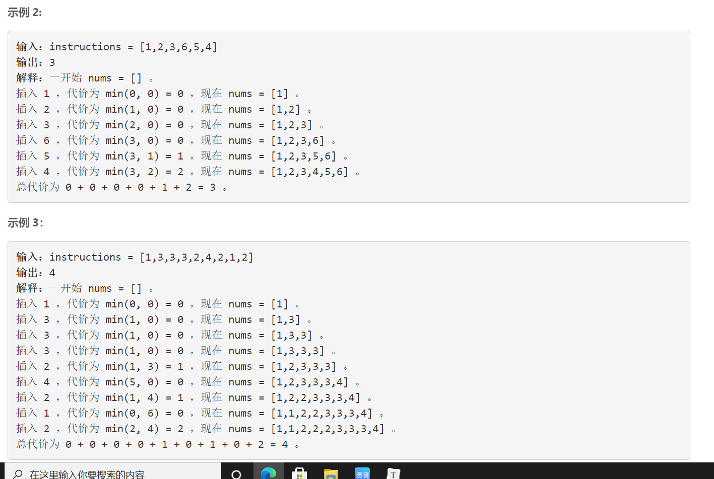
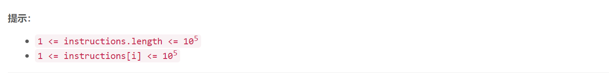

### 1649. 通过指令创建有序数组

### 

###       



## Java solution

```java
class Solution {
    long mod=(long)1e9+7;
    public int createSortedArray(int[] instructions) {
         long res=0;
         int n=(int)1e5+5;
         int[] nums=new int[n];
         BinaryIndexedTree b=new BinaryIndexedTree(nums); // 树状数组 数组每个出现位置对应instructions中元素值出现的次数 
         for(int i:instructions)
         {
             long cost=(long)Math.min(b.sumRange(0,i-1),b.sumRange(i+1,n-1));
             res=(res+cost)%mod;
             b.plusOne(i);
         }
         return (int)res;
    }
}
class BinaryIndexedTree {
    int[] c;
    int[] a;
    int n;
    public BinaryIndexedTree(int[] nums) {
       n=nums.length; 
       c=new int[n+1];
       for(int i=0;i<n;i++)
       {
           add(i+1,nums[i]);
       }
       a=nums;
    }
    
    public void update(int i, int val) {
       add(i+1,val-a[i]);
       a[i]=val;
    }
    
    public void plusOne(int i) {
       add(i+1,1);
       a[i]=a[i]+1;
    }
    
    public int sumRange(int i, int j) {
       return getSum(j+1)-getSum(i);
    }
  
    private int getSum(int x)
    {
        int res=0;
        for(int i=x;i>0;i-=lowbit(i))
        {
           res+=c[i];
        }
         return res;
    }
    private void add(int x,int y)
    {
        for(int i=x;i<=n;i+=lowbit(i))
        {
            c[i]+=y;
        }
    }
     
    private int lowbit(int x){ return x&(-x);}
}

```