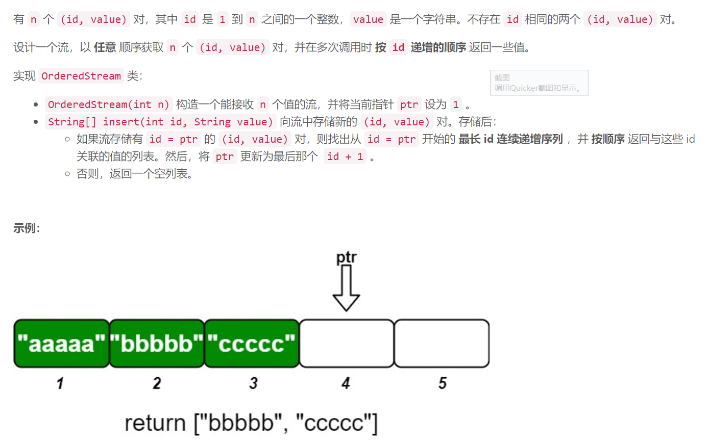
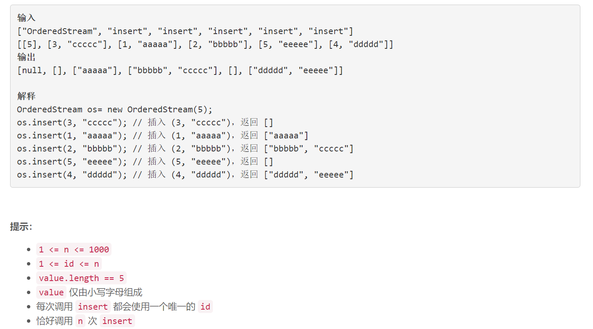

### 5601. 设计有序流

  



## Java solution

```java
class OrderedStream {
    String[] s;
    int ptr;
    int n;
    public OrderedStream(int n) {
       s=new String[n];
       ptr=1;
       this.n=n; 
    }
    
    public List<String> insert(int id, String value) {
        List<String> res=new ArrayList<>();
        s[id-1]=value;
        if(id==ptr)
        {
            for(;ptr<=n && s[ptr-1]!=null;ptr++) res.add(s[ptr-1]);
        }
        return res;
    }
}

/**
 * Your OrderedStream object will be instantiated and called as such:
 * OrderedStream obj = new OrderedStream(n);
 * List<String> param_1 = obj.insert(id,value);
 */
```