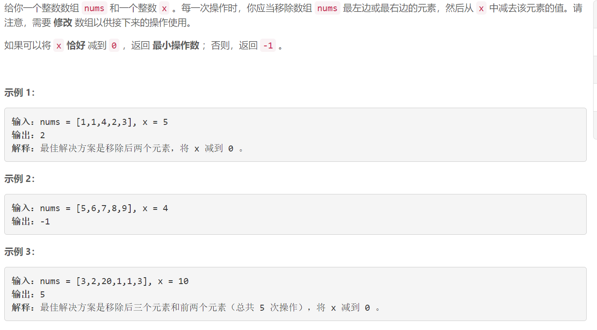
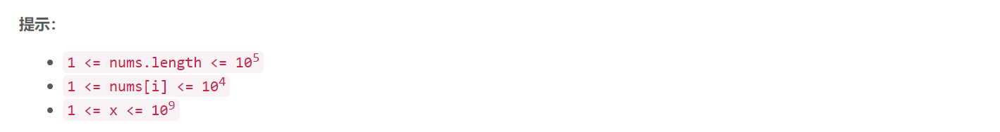

### 5602. 将 x 减到 0 的最小操作数

###     



## Java solution 

```java
class Solution {
    public int minOperations(int[] nums, int x) {
        int n=nums.length;
        HashMap<Integer,Integer> map=new HashMap<>();
        int left=0,right=0;
        int res=n+5;
        for(int i=n-1;i>=0;i--)
        {
            right+=nums[i];
            if(right==x) res=Math.min(res,n-i);
            map.put(right,i);
        }
        for(int i=0;i<n;i++)
        {
            left+=nums[i];
            int target=x-left;
            if(target>0)
            {
                Integer j=map.get(target);
                if(j!=null && j>i) res=Math.min(res,i+1+n-j);
            }
            else if(target==0) res=Math.min(res,i+1);
            else break;
            
        }
        return res==(n+5)?-1:res;
    }
}
```

