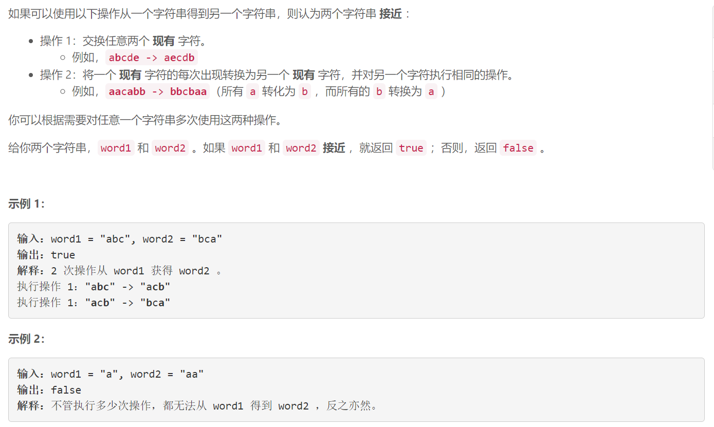
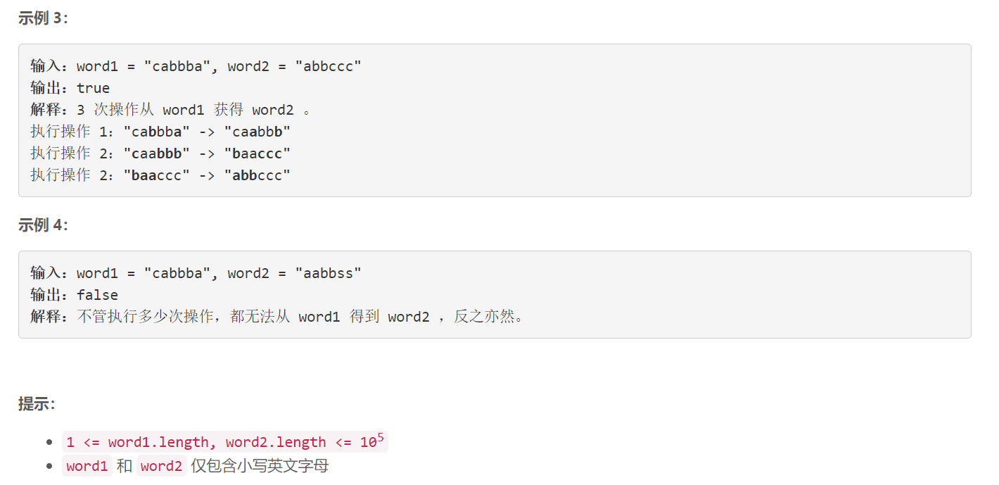

### 5603. 确定两个字符串是否接近

###      



## Java solution

```java
class Solution {
    public boolean closeStrings(String word1, String word2) {
        List<Integer> l1=new ArrayList<>();
        List<Integer> l2=new ArrayList<>();
        char[] c1=word1.toCharArray();
        char[] c2=word2.toCharArray(); 
        int n1=c1.length;
        int n2=c2.length;
        if(n1!=n2) return false;
        boolean[] b1=new boolean[26];
        boolean[] b2=new boolean[26];
        Arrays.sort(c1);
        Arrays.sort(c2);
        for(int i=0;i<n1;i++)
        {
            b1[(int)(c1[i]-'a')]=true;
            int cnt=1;
            for(;i<n1-1&&c1[i]==c1[i+1];cnt++,i++);
            l1.add(cnt);
        }
        for(int i=0;i<n1;i++)
        {
            b2[(int)(c2[i]-'a')]=true;
            int cnt=1;
            for(;i<n1-1&&c2[i]==c2[i+1];cnt++,i++);
            l2.add(cnt);
        }
        for(int i=0;i<26;i++) if(b1[i]!=b2[i]) return false;
        Collections.sort(l1);
        Collections.sort(l2);
        
        if(l1.size()!=l2.size()) return false;
        int n=l1.size();
        for(int i=0;i<n;i++)
        {
            if(!l1.get(i).equals(l2.get(i))) return false;
        }
        return true;
    }
}
```


