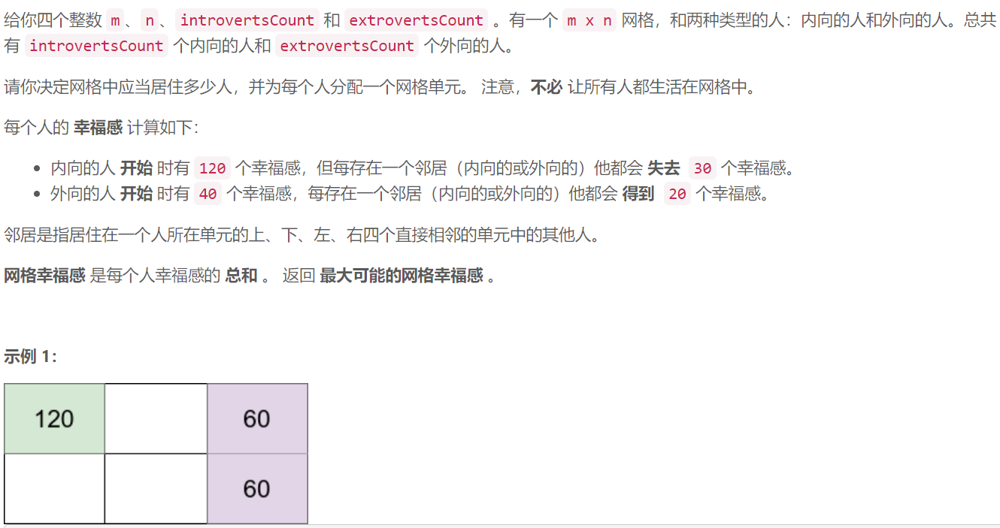
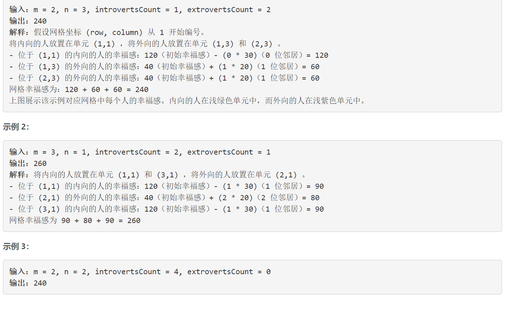
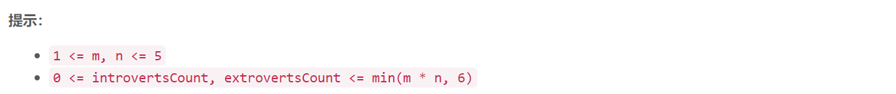

### 5604. 最大化网格幸福感

### 

###       



## Java solution

```java
//题解 https://leetcode-cn.com/problems/maximize-grid-happiness/solution/you-yi-chong-zhuang-ya-jiao-zuo-hua-dong-chuang-ko/
class Solution {
    public int getMaxGridHappiness(int m, int n, int introvertsCount, int extrovertsCount) {
        int cases=(int)Math.pow(3,n);
        int cases_1=(int)Math.pow(3,n-1);
        int a=introvertsCount,b=extrovertsCount;
        /*
        因此，我们可以采用滑动窗口的方式定义状态：
        dp[i][j][x][y][status]
        i-当前考虑的横坐标
        j-当前考虑的纵坐标
        x-当前外向还剩多少
        y-当前内向还剩多少
        status-前 nn 个格子的状态。
        */
        int[][][][] dp=new int[m*n+1][a+1][b+1][cases];
        /*
        无人 内向 外向
    无人 0    0    0
    内向 0   -60  -10
    外向 0   -10  40
        */
        int[][] offset=new int[][]{{0,0,0},{0,-60,-10},{0,-10,40}};

        for(int p=m*n-1;p>=0;p--)for(int x=0;x<=a;x++) 
        for(int y=0;y<=b;y++) for(int pre=0;pre<cases;pre++)// pre 就是前 n 个格子的状态（三进制）
        {
            int i=p/n,j=p%n;
            int nem=(pre*3)%cases;// nem 是 pre “左移” 一位, 并去掉首位的状态,比如三进制 2121->三进制 1210.
            if(x>0)// 当前位置内向
            {
            /*
            如何获取一个三进制状态的第一个数和最后一个数：
            第一个数 first = status / pow(3, n-1)
            最后一个数 last = status % 3
            */ 
               int diff=120+(j==0?0:1)*offset[1][pre%3]+(i==0?0:1)*offset[1][pre/cases_1];
               dp[p][x][y][pre]=Math.max(dp[p][x][y][pre],dp[p+1][x-1][y][nem+1]+diff);
            }
            if(y>0)//当前位置外向
            {
               int diff=40+(j==0?0:1)*offset[2][pre%3]+(i==0?0:1)*offset[2][pre/cases_1];
               dp[p][x][y][pre]=Math.max(dp[p][x][y][pre],dp[p+1][x][y-1][nem+2]+diff);
            }
            //当前位置不放
            dp[p][x][y][pre]=Math.max(dp[p][x][y][pre],dp[p+1][x][y][nem]);
        }
        return dp[0][a][b][0];
    }
}


```