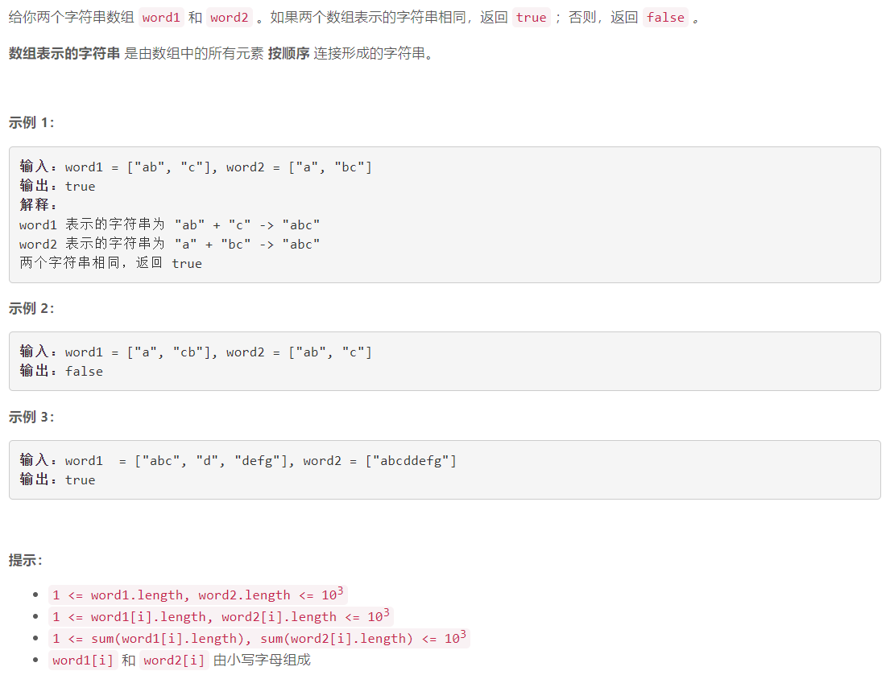
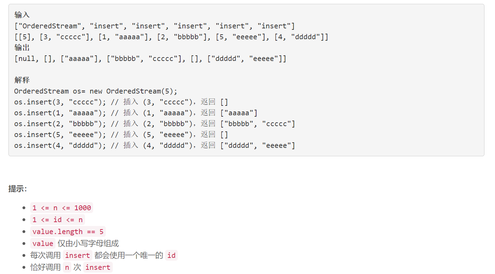

### 5605. 检查两个字符串数组是否相等

  



## Java solution

```java
class Solution {
    public boolean arrayStringsAreEqual(String[] word1, String[] word2) {
         String s1="",s2="";
        for(String w:word1) s1+=w;
        for(String w:word2) s2+=w;
        return s1.equals(s2);
    }
}
```