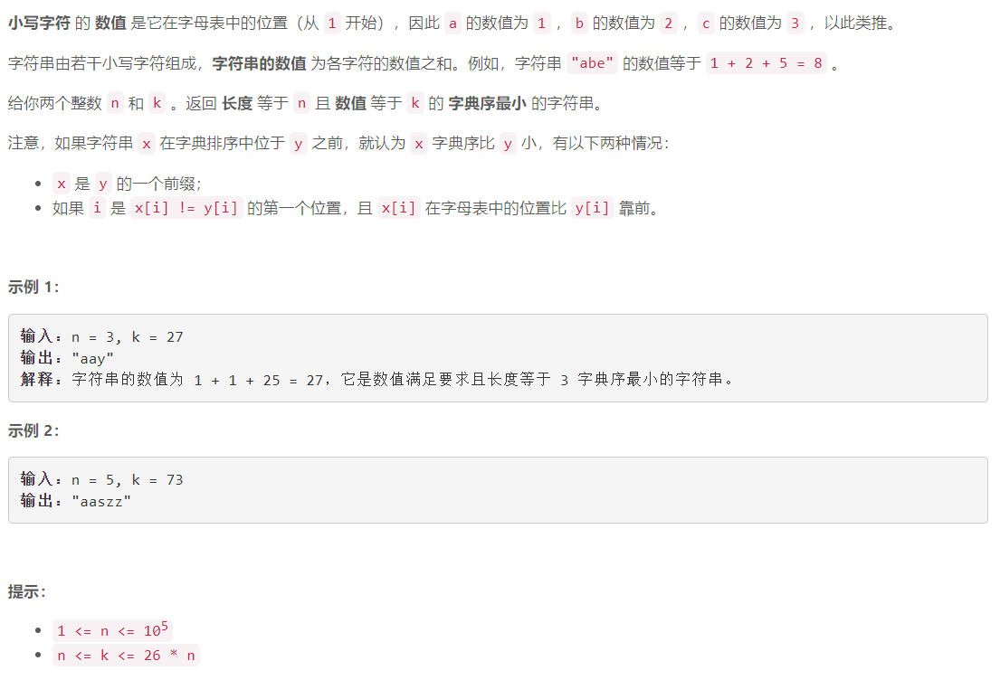

### 5606. 具有给定数值的最小字符串

###     

## Java solution 

```java
class Solution {
    public String getSmallestString(int n, int k) {
       StringBuilder res=new StringBuilder(); 
        // k-x>=l
        // k-x<=u
        // x<=k-l
        // x>=k-u
        //  26>=x>=1
        // x>=max(1,k-u)
       for(int i=n;i>1;i--)
       {
           int u=(i-1)*26,l=i-1;
           int j=Math.max(k-u,1);
           res.append((char)(j-1+'a'));
           k-=j;
       }
        res.append((char)(k-1+'a'));
       return res.toString(); 
    }
}
```

