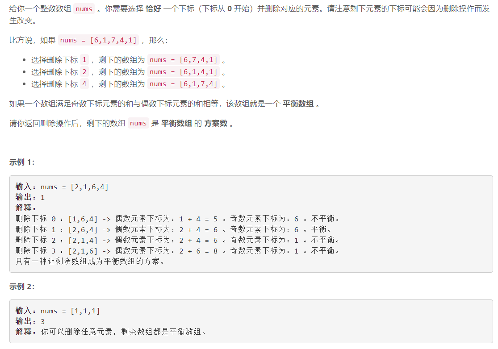

### 5607. 生成平衡数组的方案数

###      


## Java solution

```java
class Solution {
    public int waysToMakeFair(int[] nums) {
       int n=nums.length; 
       int[][] dp1=new int[n+5][2];
       int[][] dp2=new int[n+5][2];
       for(int i=0;i<n;i++)
       {
           if(i%2==0)
           {
             dp1[i][0]=(i>1?dp1[i-2][0]:0)+nums[i];   
           }
           else
           {
             dp1[i][1]=(i>1?dp1[i-2][1]:0)+nums[i];   
           }
       }
       
       for(int i=n-1;i>=0;i--)
       {
           if(i%2==0)
           {
             dp2[i][0]=(i<n-2?dp2[i+2][0]:0)+nums[i];   
           }
           else
           {
             dp2[i][1]=(i<n-2?dp2[i+2][1]:0)+nums[i];   
           }
       } 
       int res=0; 
       for(int i=0;i<n;i++)
       {
           int l0,l1,r0,r1;
           if(i%2==0)
           {
             l0=i>1?dp1[i-2][0]:0;
             l1=i>0?dp1[i-1][1]:0  ;
             r1=i<n-2?dp2[i+2][0]:0;
             r0=i<n-1?dp2[i+1][1]:0  ; 
             
           }
           else
           {
             l0=i>0?dp1[i-1][0]:0;
             l1=i>1?dp1[i-2][1]:0  ;
             r1=i<n-1?dp2[i+1][0]:0;
             r0=i<n-2?dp2[i+2][1]:0  ;   
           }
           //System.out.print(l0+" "+l1+" "+r0+" "+r1+"\n");  
           if((l0+r0)==(l1+r1)){
               res++;
              // System.out.print(i+" ");
           }
       }
       return res;
    }
}
```


