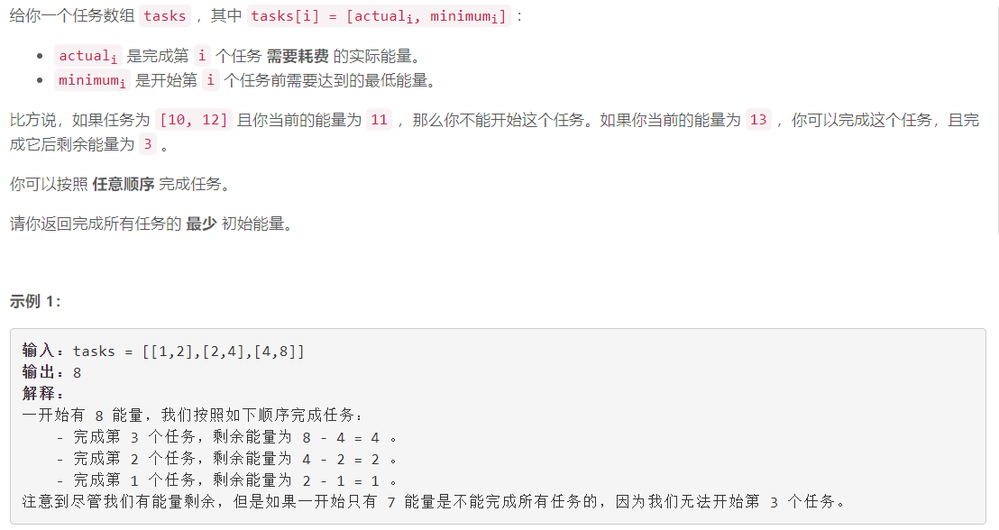
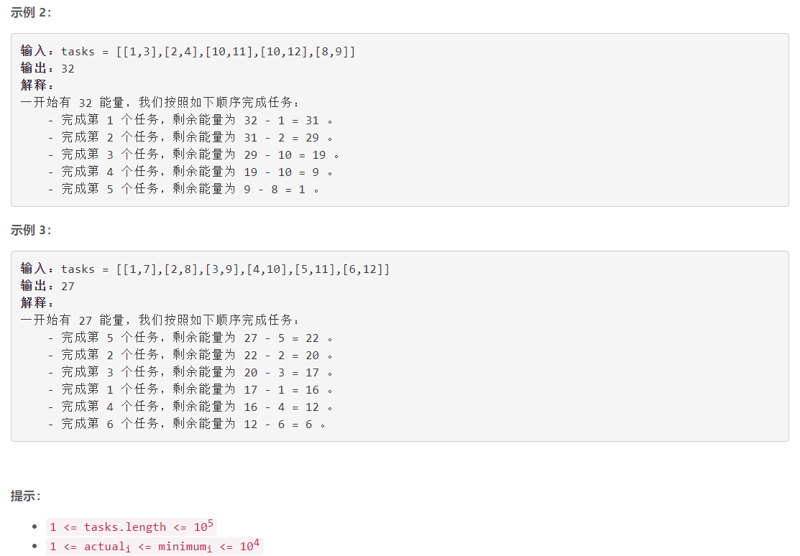

### 5608. 完成所有任务的最少初始能量

### 

###       

## Java solution

```java
class Solution {
    public int minimumEffort(int[][] tasks) {
        int n=tasks.length;
        /*贪心，逆向思考

        总的要消耗的能量是一致的，那么要让留下来的能量尽量少
        对数组排序，优先按照剩下的能量排序，如果能量相同则优先按照需要的最小能量排序*/
        Arrays.sort(tasks,(a,b)->(a[1]-a[0])-(b[1]-b[0]));// 按照剩余量的大小排序
        int cur=0;
        for(int i=0;i<n;i++)
        {
            cur=Math.max(tasks[i][1],cur+tasks[i][0]);
        }
        return cur;
            
    }

}


```