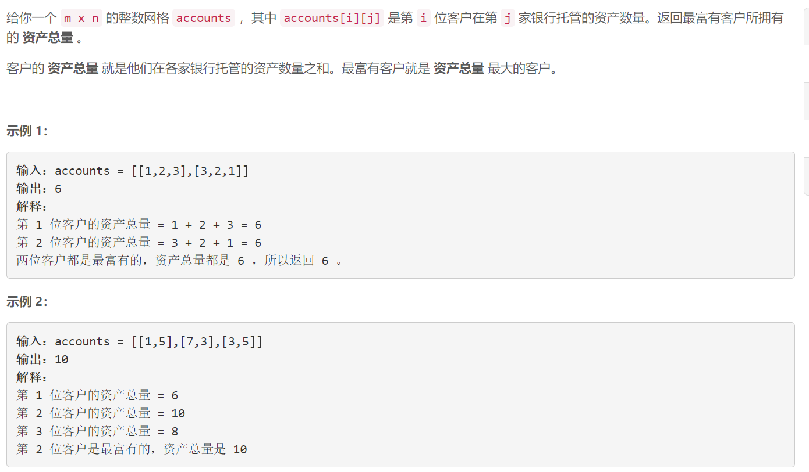

### 5613. 最富有客户的资产总量

###     

## Java solution 

```java
class Solution {
    public int maximumWealth(int[][] accounts) {
         int res=0;
        for(int[] a:accounts)
        {
            int cur=0;
            for(int i:a) cur+=i;
            res=Math.max(res,cur);
        }
        return res;
    }
}
```

