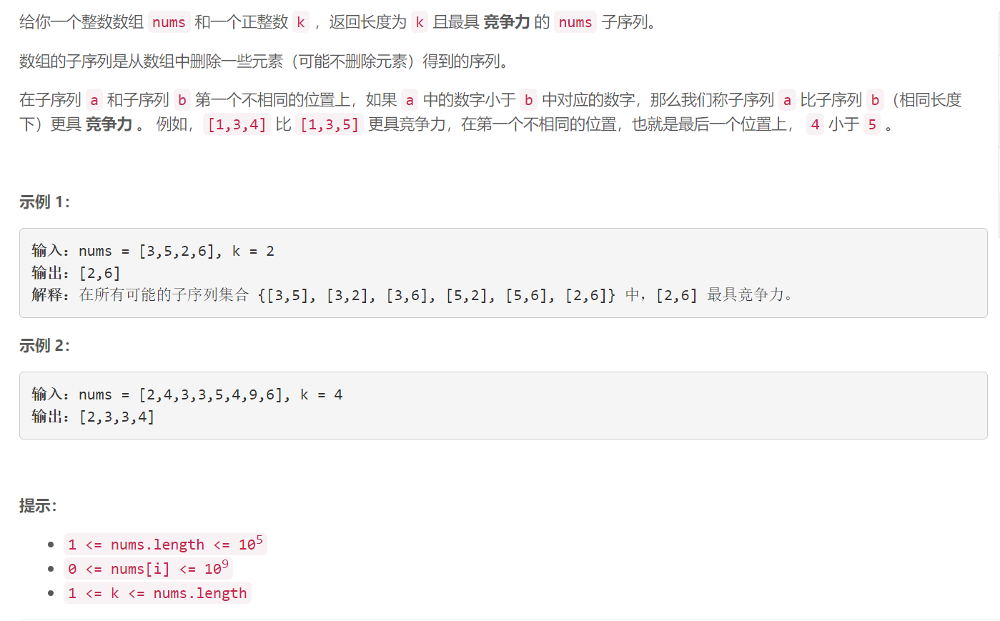

### 5614. 找出最具竞争力的子序列

###      

## Java solution

```java
class Solution {
    public int[] mostCompetitive(int[] nums, int k) {
         Stack<Integer> s=new Stack<>();
         int n=nums.length;
         for(int i=0;i<n;i++)
         {
             //这里n-i>k-s.size() 不是大于等于是因为s接下来会弹出一个元素 s.size()减少
             while(!s.isEmpty() && nums[i]<s.peek() && n-i>k-s.size()) s.pop();
             if(s.size()<k) s.push(nums[i]);
         }
         int[] res=new int[k];
         for(int i=k-1;i>=0;i--) res[i]=s.pop();
         return res;
    }
}
```


