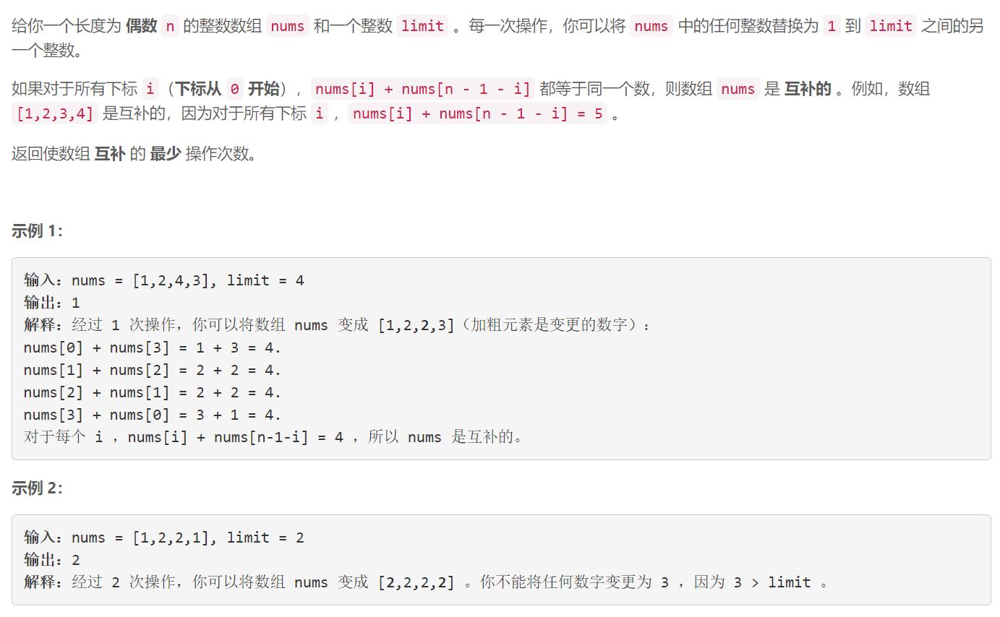
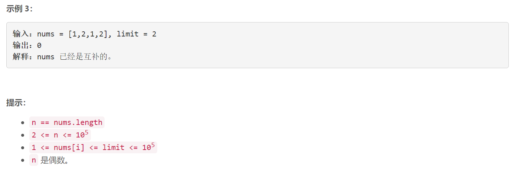

### 5615. 使数组互补的最少操作次数

### 

###       

## Java solution

```java
class Solution {
    public int minMoves(int[] nums, int limit) {
         int[] diff=new int[2*limit+5];
         int n=nums.length;
         int l,r;
         // res[x] 表示nums[i]+nums[n-i-1]=x 需要的操作数
         //diff[x]=res[x]-res[x-1] 
         // res[x]=sum(diff[0...x])
         for(int i=0;i<n/2;i++)
         {
              // 差分数组, diff[0...x] 的和表示最终互补的数字和为 x，需要的操作数
             // 因为差分数组的计算需要更新 r + 1，所以数组的总大小在 limit * 2 + 1 的基础上再 + 1
             int a=nums[i],b=nums[n-i-1];

             // [2, 2 * limit] 范围 + 2  当前范围内每个x最多增加两次操作
             l=2;r=2*limit;
             diff[l]+=2;diff[r+1]-=2;
             // [1 + min(A, B), limit + max(A, B)] 范围 -1  只需要修改一个数 操作数-1
             l=1+Math.min(a,b);r=limit+Math.max(a,b);
             diff[l]+=-1;diff[r+1]-=-1;
             // [A + B] 再 -1    a+b位置无需修改 操作数-1
             l=a+b;r=a+b;
             diff[l]+=-1;diff[r+1]-=-1;
         }
         int res=n,sum=0;
         for(int i=2;i<=2*limit;i++) 
         {
             sum+=diff[i];
             res=Math.min(res,sum);
         }
         return res;
    }
}


```