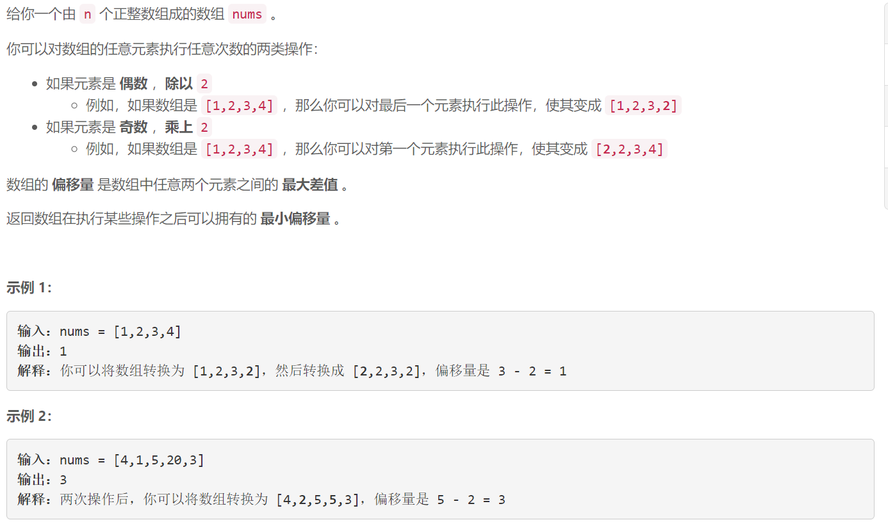
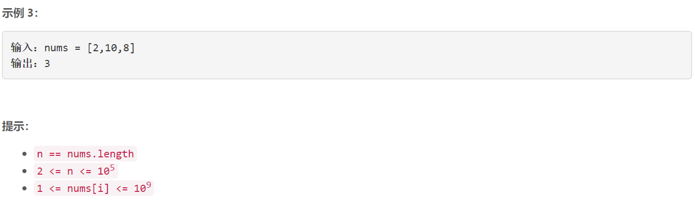

### 5616. 数组的最小偏移量

  



## Java solution

```java
class Solution {
    public int minimumDeviation(int[] nums) {
       // 对于奇数x来讲 变换过程中只能有x和2x两种情况 
       // 对于偶数x来讲 可能有 x x/2 x/4 。。。 x/(2^n) 这些情况 x/(2^n)为奇数时停止
       // 所以枚举这些数 维护一个terrset 将最大值和最小值相减即为可能的偏移量
       // 这里截止条件是最大值为奇数 比如 3 4 5 偏移量为2 如果缩小4只会让偏移量变大 
       TreeSet<Integer> t=new TreeSet<>();
       for(int n:nums)
       {
           t.add(n%2==0?n:n*2);
       }
       int res=(int)1E9+7;
       while(!t.isEmpty() && t.last()%2==0)
       {
           int max=t.last();
           int min=t.first();
           res=Math.min(res,max-min);
           t.remove(max);
           t.add(max/2);
       }
       //考虑最大值为奇数时的情况
       res=Math.min(res,t.last()-t.first());
       return res;
    }
}

```