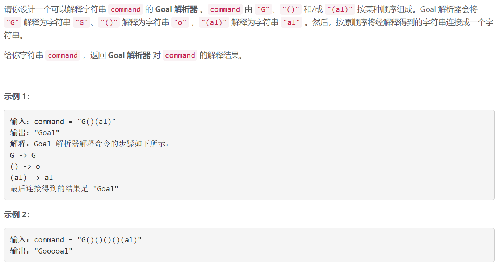

### 5617. 设计 Goal 解析器

###     

## Java solution 

```java
class Solution {
    public String interpret(String command) {
        String res="";
        String c=command;
        int n=c.length();
        for(int i=0;i<n;i++)
        {
            if(c.charAt(i)=='G')
            {
                res+='G';
            }
            else
            {
                if(i+1<n)
                {
                    if(c.charAt(i+1)=='a') {
                        res+="al";
                        i+=3;
                    }
                    else 
                    {
                        res+='o';
                        i++;
                    }
                }
            }
        }
        return res;
    }
}
```

