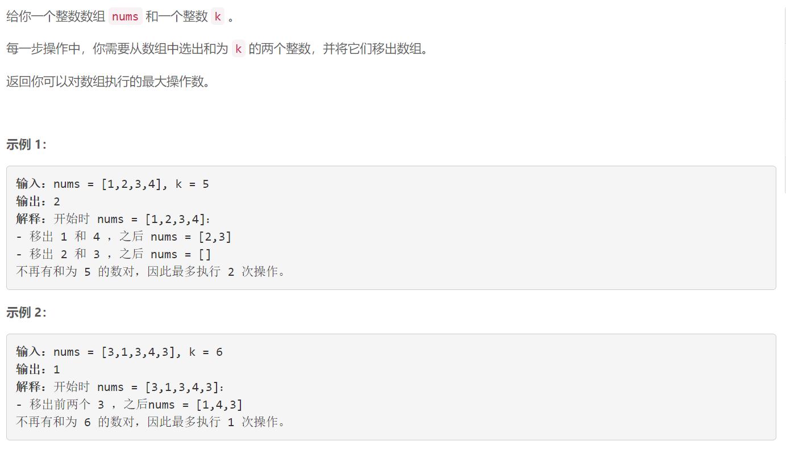
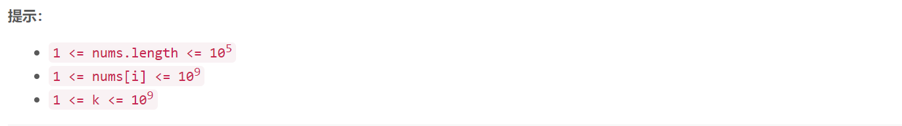

### 5618. K 和数对的最大数目

###      



## Java solution

```java
class Solution {
    public int maxOperations(int[] nums, int k) {
       HashMap<Integer,Integer> map=new HashMap<>();
        int n=nums.length;
        int res=0;
        for(int i=0;i<n;i++)
        {
            if(map.getOrDefault(k-nums[i],0)>0)
            {
                res++;
                int cnt=map.get(k-nums[i]);
                map.put(k-nums[i],cnt-1);
            }
            else
            {
                int cnt=map.getOrDefault(nums[i],0);
                map.put(nums[i],cnt+1);
            }
        }
        return res;
    }
}
```


