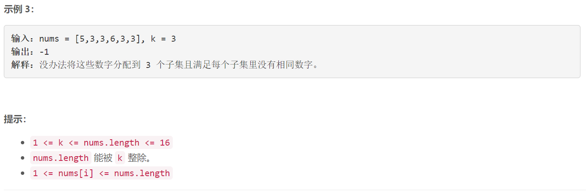

### 5619. 最小不兼容性

  



## Java solution

```java
class Solution {
    int inf=(int)1e9;
    public int minimumIncompatibility(int[] nums, int k) {
        int n=nums.length;
        if(k==n) return 0;
        int sz=n/k;
        int[] dp=new int[1<<n+5];// dp[i] 表示i状态下 不兼容性 的 和 的 最小值  i的第j位为1 说明nums[j] 被选中
        int[] diff=new int[1<<n+5];//diff[i] 表示i状态下 最大值和最小值的差值   i的第j位为1 说明nums[j] 被选中
        for(int s=1;s<(1<<n);s++)
        {
            List<Integer> cur=new ArrayList<>();
            for(int i=0;i<n;i++)
            {
                if((s&(1<<i))>0)
                {
                    cur.add(nums[i]);
                }
            }
            Collections.sort(cur);
            boolean found=false;
            for(int i=0;i<cur.size()-1;i++)
            {
                if(cur.get(i)==cur.get(i+1)) 
                {
                    found=true;
                    break;
                }
            }
            if(found) diff[s]=inf;
            else diff[s]=cur.get(cur.size()-1)-cur.get(0);
        }
        for(int s=1;s<(1<<n);s++)
        {
            dp[s]=inf;
            for(int t=s;t>0;t=(t-1)&s)
            {
                if(bitCount(t)==sz)// 保证只有符合大小要求的状态才能转移 否则该状态为inf
                {
                    dp[s]=Math.min(dp[s],diff[t]+dp[s^t]);
                }
            }
        }
        if(dp[(1<<n)-1]>=inf) return -1;
        return dp[(1<<n)-1]; 
    }
    
    // 高效计算二进制n中1的个数
    private int bitCount(int n){
    n = (n & 0x55555555) + ((n >>> 1) & 0x55555555);
    n = (n & 0x33333333) + ((n >>> 2) & 0x33333333);
    n = (n & 0x0F0F0F0F) + ((n >>> 4) & 0x0F0F0F0F);
    n = (n & 0x00FF00FF) + ((n >>> 8) & 0x00FF00FF);
    n = (n & 0x0000FFFF) + ((n >>> 16) & 0x0000FFFF);
    return n;
    }
}


```