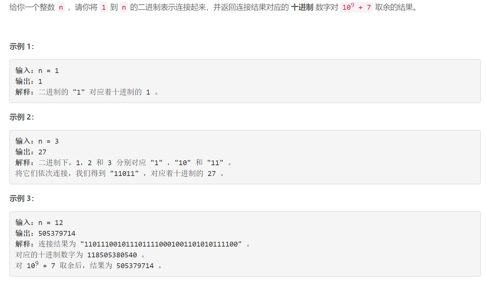

### 5620. 连接连续二进制数字

### 

###       

## Java solution

```java
class Solution {
    long mod=(long)1e9+7;
    public int concatenatedBinary(int n) {
        long res=0,base=1;
        for(long i=n;i>=1;i--)
        {
            long temp=i;
            while(i>0)
            {
                long l=i&1;
                i>>=1;
                //若a≡res (% mod)，则(a + base*l)(%p) ≡ (res + base*l)(%p)；
                res=(res+base*l)%mod;
                //若a=b%mod 则有(a*c)%mod == (b*c)%mod 
                base=(base<<1)%mod;
            }
            i=temp;
        }
        return (int)res;
    }
}


```