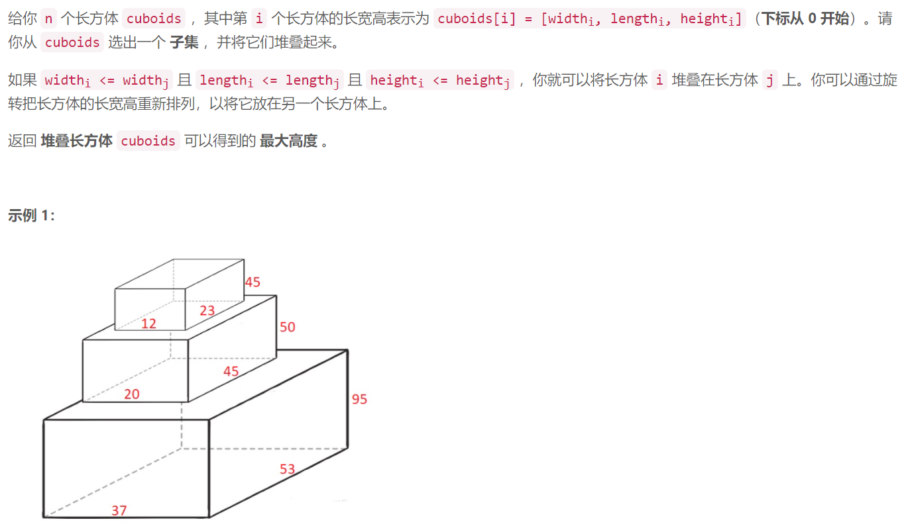
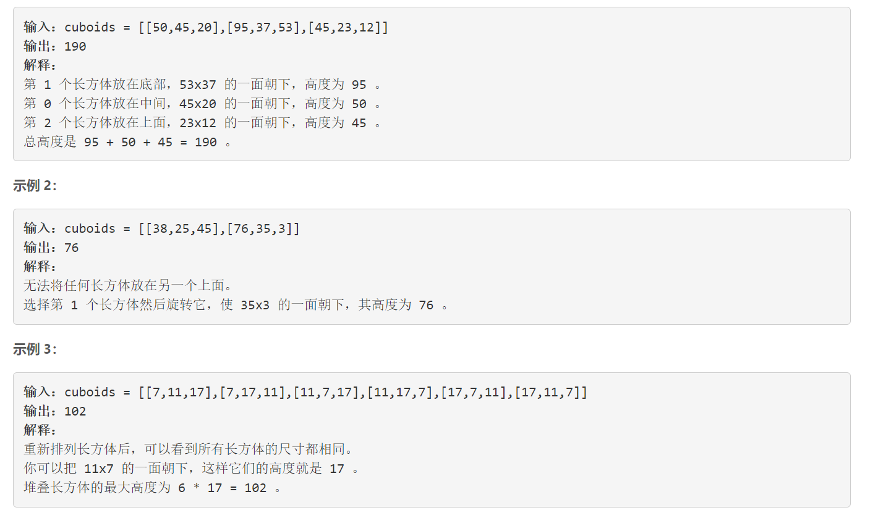
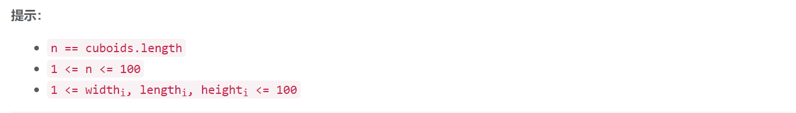

### 5245. 堆叠长方体的最大高度

### 

###       



## Java solution

```java
class Solution {
    public int maxHeight(int[][] cuboids) {
         //int[][] dp=new int[105][105]; //
         int n=cuboids.length;
         int[][] l=new int[n*6][4];
         for(int i=0;i<n;i++)
         {
             int a=cuboids[i][0],b=cuboids[i][1],c=cuboids[i][2];
             int j=i*6;
             l[j]=new int[]{a,b,c,i};
             l[j+1]=new int[]{a,c,b,i};
             l[j+2]=new int[]{b,a,c,i};
             l[j+3]=new int[]{b,c,a,i};
             l[j+4]=new int[]{c,a,b,i};
             l[j+5]=new int[]{c,b,a,i};
         }
         Arrays.sort(l,
          (a,b)->{
              if(a[0]==b[0])
              {
                  if(a[1]==b[1]) return a[2]-b[2];
                  else return a[1]-b[1];
              }
              else
              {
                  return a[0]-b[0];
              }
          }          );
         int res=0;
         int[] dp=new int[n*6];
         //这里主要的疑惑是i-->j-->k i和k可能来自同一个长方体 但是一个长方体能在另一个长方体上的前提条件是 l[i][0]>=l[j][0]&&l[i][1]>=l[j][1]&&l[i][2]>=l[j][2]  如果i j之间满足这种关系 那么 j和k之间就不可能满足这种关系 因为i和k的构成是相同的 只是顺序变了 i无论怎么排列都不可能满足 l[j][0]>=l[k][0]&&l[j][1]>=l[k][1]&&l[j][2]>=l[k][2]
         for(int i=0;i<n*6;i++)
         {
             for(int j=0;j<i;j++)
             {
                 if(l[i][0]>=l[j][0]&&l[i][1]>=l[j][1]&&l[i][2]>=l[j][2]&&l[i][3]!=l[j][3])
                 dp[i]=Math.max(dp[i],dp[j]);
             }
             dp[i]+=l[i][2];
             res=Math.max(res,dp[i]);
         }
         return res;

    }
   
}


```