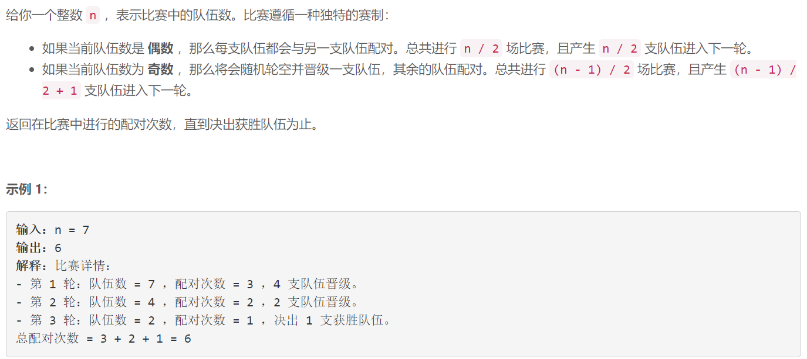
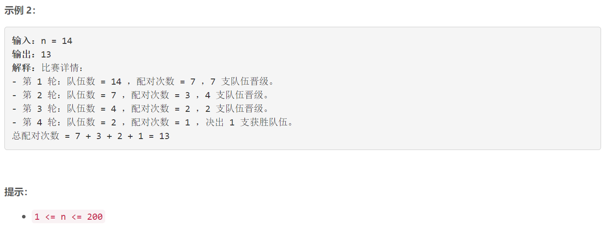

### 5625. 比赛中的配对次数

  



## Java solution

```java
class Solution {
    public int numberOfMatches(int n) {
        int res=0;  
        while(n!=1)
        {
            res+=n/2;
            n=n/2+n%2;
        }
        return res;
    }
}


```