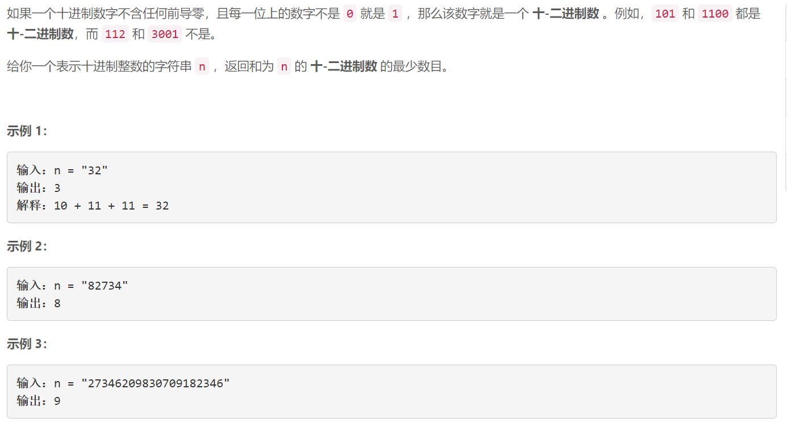
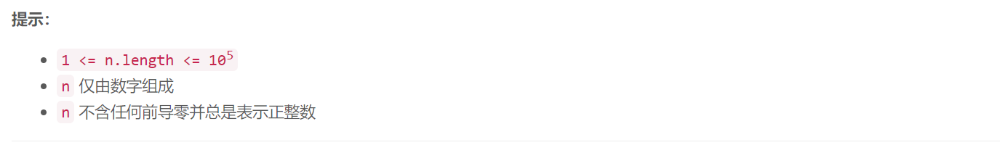

### 5626. 十-二进制数的最少数目

###      



## Java solution

```java
class Solution {
    public int minPartitions(String n) {
        int res=0;
        for(char c:n.toCharArray())
        {
            res=Math.max(res,(int)(c-'0'));
        }
        return res;
    }
}
```


