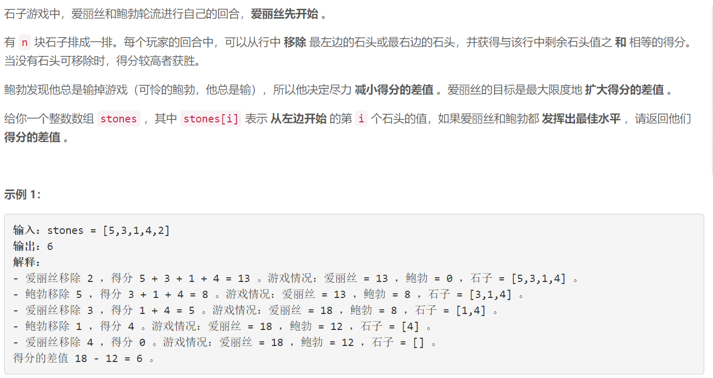
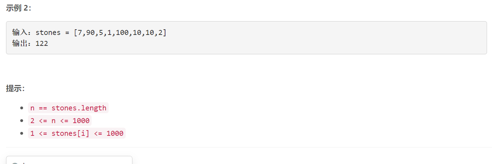

### 5627. 石子游戏 VII

###     



## Java solution 

```java
class Solution {
    public int stoneGameVII(int[] stones) {
        int n=stones.length;
        int[][] dp=new int[n][n];//dp[i][j] 表示在区间 [i, j] 内 Alice 比 Bob 多拿的石子数
        int[][] sum=new int[n][n];
        for(int i=0;i<n;i++)
        {
            sum[i][i]=stones[i];
            for(int j=i+1;j<n;j++)
            {
                sum[i][j]=sum[i][j-1]+stones[j];
            }
        }
        // dp[i][i]=0 因为移除一个以后无石子可拿
        // len是i j之间的长度 这个区间是逐渐变大的 从2个石子堆到n个石子堆 len=1 实际上有的是两个十字对dp[i][i+1] 对应i和i+1石子堆
        for(int len=1;len<n;len++)for(int i=0;i<n-len;i++)
        {
            int j=i+len;
            dp[i][j]=Math.max(sum[i][j-1]-dp[i][j-1],sum[i+1][j]-dp[i+1][j]);// 当alice拿时 dp[i][j-1]可以代表bob在区间[i,j-1]之内比alice多的石子数目 因为二者谁先手都尽量比对方多
        }
        return dp[0][n-1];
    }
}
```

