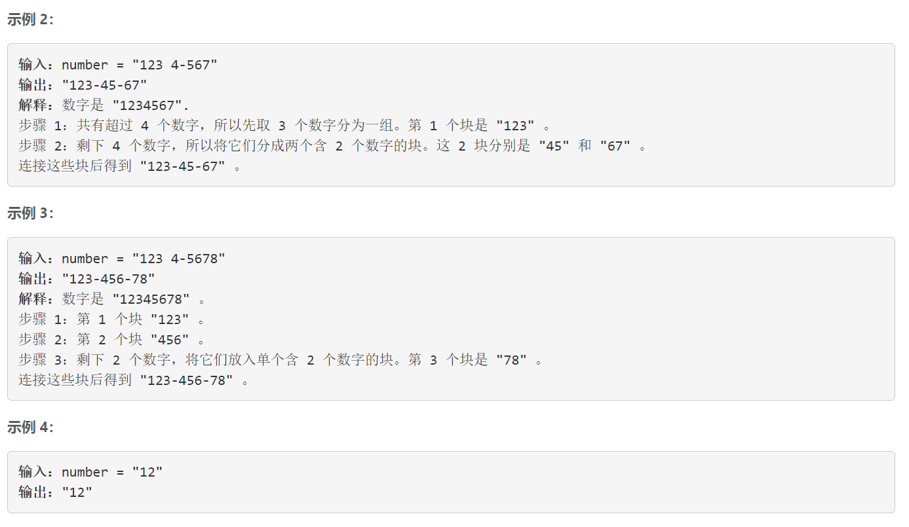
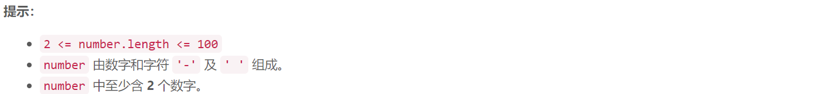

### 5629. 重新格式化电话号码

### 

###       



## Java solution

```java
class Solution {
    public String reformatNumber(String number) {
        StringBuilder s=new StringBuilder("");
        for(char c:number.toCharArray())
        {
            if(c>='0'&& c<='9')s.append(c);
        }
        StringBuilder res=new StringBuilder("");
        int i=0;
        for(;i<s.length()-4;i+=3)
        {
            for(int j=i;j<i+3;j++)
            {
                res.append(s.charAt(j));
            }
            res.append('-');
        }
        int len=s.length()-i;
        if(len==4)
        {
            for(;i<s.length()-2;i++) res.append(s.charAt(i));
            res.append('-');
        }
        for(;i<s.length();i++) res.append(s.charAt(i));

        return res.toString();
    }
}

```