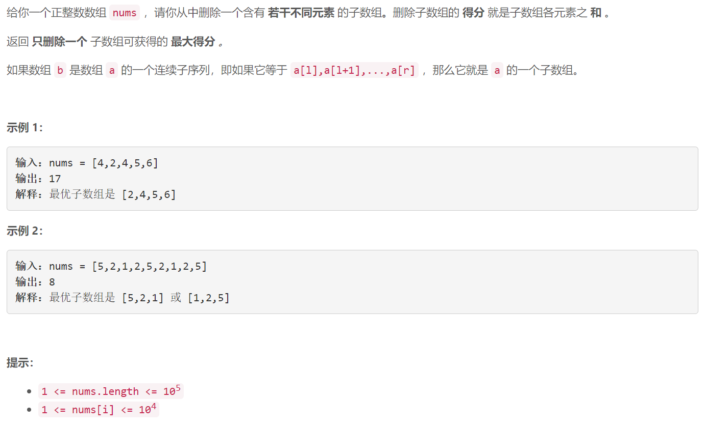

### 5630. 删除子数组的最大得分

  

## Java solution

```java
class Solution {
    public int maximumUniqueSubarray(int[] nums) {
        Set<Integer> s=new HashSet<>();
        Queue<Integer> q=new LinkedList<>();
        int n=nums.length;
        int sum=0;
        int res=0;
        for(int i=0;i<n;)
        {
            for(;i<n && !s.contains(nums[i]);i++)
            {
                s.add(nums[i]);
                q.offer(nums[i]);
                sum+=nums[i];
                res=Math.max(sum,res);
            } 
            if(i>=n) break;
            for(;!q.isEmpty() && s.contains(nums[i]);)
            {
                s.remove(q.element());
                sum-=q.element();
                q.poll();
            }
            
        }
        return res;
    }
}

```