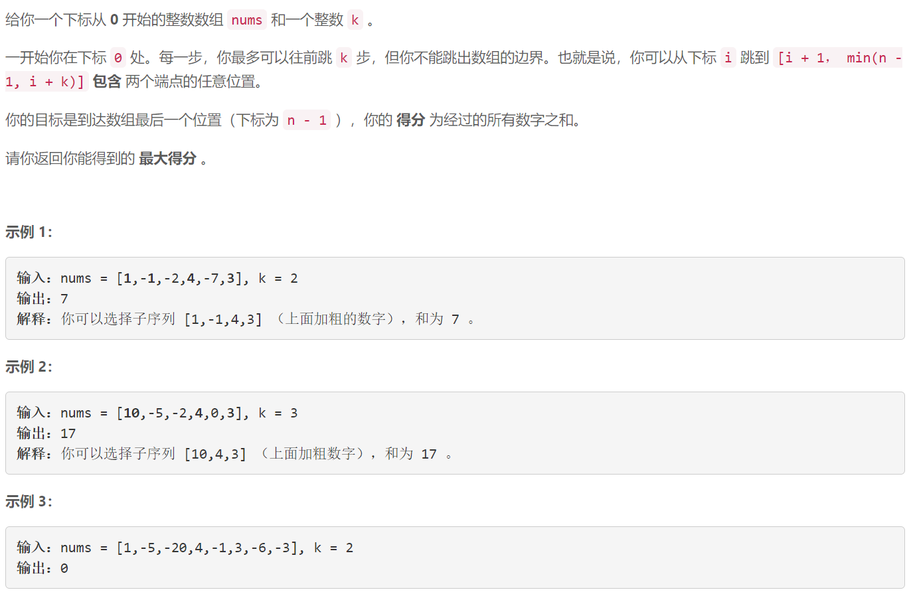
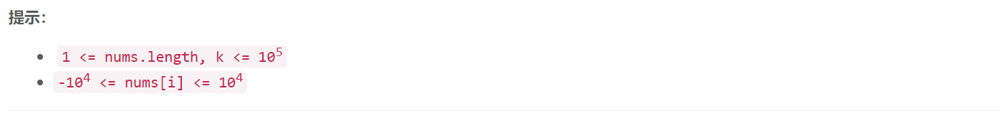

### 5631. 跳跃游戏 VI

###      



## Java solution

```java
class Solution {
    public int maxResult(int[] nums, int k) {
        int n=nums.length;
        if(n==1) return nums[0];
        Deque<int[]> q=new LinkedList<>();//递减的单调队列 队首是最大值
        q.offerLast(new int[]{nums[0],0});
        for(int i=1;i<n-1;i++)
        {
            while(!q.isEmpty() && i-q.peekFirst()[1]>k)  q.pollFirst();
            int cur=q.peekFirst()[0]+nums[i];
            while(!q.isEmpty() && q.peekLast()[0]<cur) q.pollLast();
            q.offerLast(new int[]{cur,i});
        }
        while(!q.isEmpty() && n-1-q.peekFirst()[1]>k)  q.pollFirst();
        return q.peekFirst()[0]+nums[n-1];
    }
}
```


