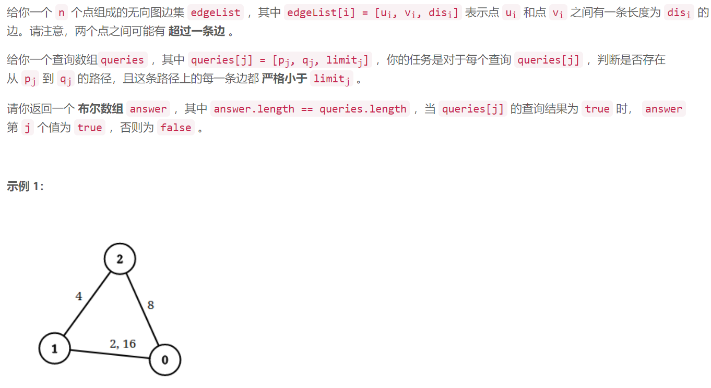
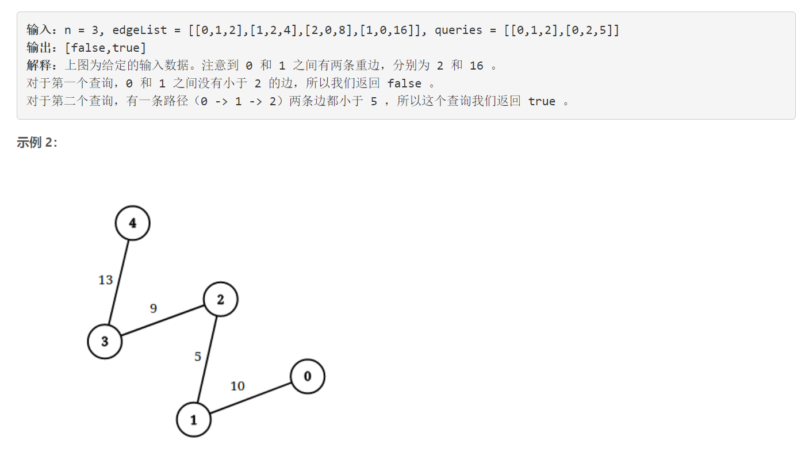
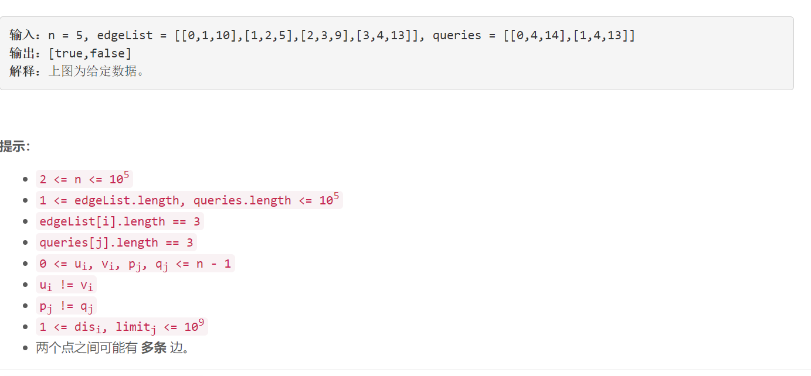

### 5632. 检查边长度限制的路径是否存在

###     





## Java solution 

```java
class Solution {
    public boolean[] distanceLimitedPathsExist(int n, int[][] edgeList, int[][] queries) {
         int n1=queries.length;
         int n2=edgeList.length;
         boolean[] res=new boolean[n1];
         UnionFind uf=new UnionFind(n);
         int[][] q=new int[n1][4];
         for(int i=0;i<n1;i++)
         {
             q[i][0]=queries[i][0];
             q[i][1]=queries[i][1];
             q[i][2]=queries[i][2];
             q[i][3]=i;// dim 3 存放原始索引
         }
         Arrays.sort(q,(a,b)->a[2]-b[2]);// 按照limit大小进行排序  
         Arrays.sort(edgeList,(a,b)->a[2]-b[2]);// 按照dis大小进行排序
         int j=0;
         for(int i=0;i<n1;i++)
         {
             for(;j<n2 && edgeList[j][2]<q[i][2];j++)// 使用所有小于limit的边 
             {
                 uf.connect(edgeList[j][0],edgeList[j][1]);
             }
             res[q[i][3]]=uf.findRoot(q[i][0])==uf.findRoot(q[i][1]);// 判断是否相连
         }
        return res;
    }
}

class UnionFind
{
    int n;
    int[] parent,size;
    UnionFind(int n)
    {
        this.n=n;
        parent=new int[n];
        size=new int[n];
        for(int i=0;i<n;i++) 
        {
            size[i]=1;
            parent[i]=i;
        }
    }
    int findRoot(int idx)
    {
        if(parent[idx]==idx) return idx;
        return parent[idx]=findRoot(parent[idx]);
    }
    
    void connect(int a,int b)
    {
        int pa=findRoot(a),pb=findRoot(b);
        if(pa!=pb)
        {
            if(size[pa]>size[pb])
           {
            parent[pb]=pa;//这里一定要注意将根节点相连
            size[pa]+=size[pb];
           }
           else
           {
            parent[pa]=pb;
            size[pb]+=size[pa];
           }
        }
    }
}
```

