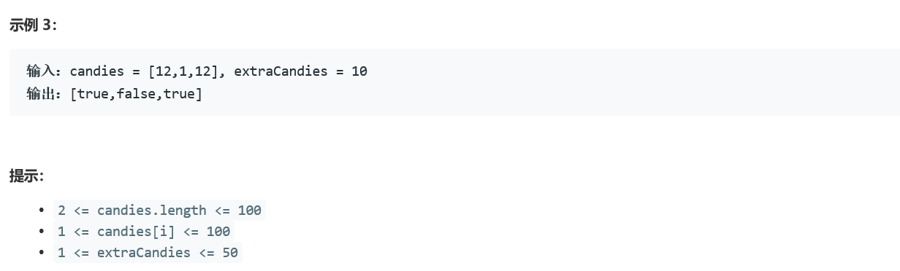

### 5384. 拥有最多糖果的孩子


    

  


## Java solution
```java
class Solution {
    public List<Boolean> kidsWithCandies(int[] candies, int extraCandies) {
          List<Boolean> res=new ArrayList<>();
          int max=candies[0]; 
          for(int i=0;i<candies.length;i++)
          {
              max=Math.max(candies[i],max);
          }
        for(int i=0;i<candies.length;i++)
          {
              if(candies[i]+extraCandies>=max)res.add(true);
              else res.add(false);
          }
         return res;
    }
}
```