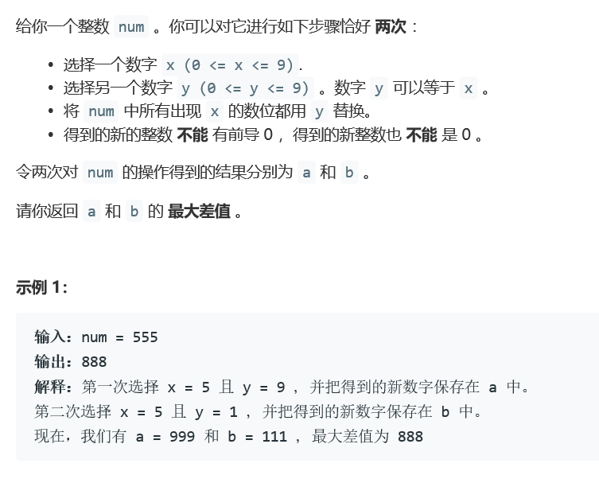
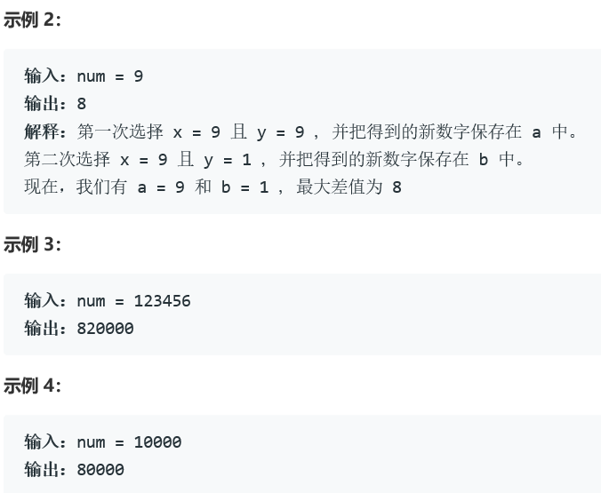
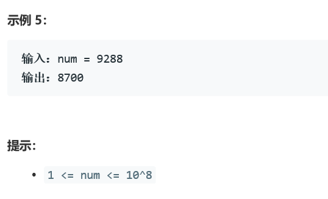

### 5385.改变一个整数能得到的最大差值  



     


## Java solution
```java
class Solution {
    public int maxDiff(int num) {
       List<Integer> cur=new ArrayList<>();
       while(num!=0)
       {
           cur.add(num%10);
           num/=10;
       }
       int res=0;
       int  LSB=cur.get(cur.size()-1);
        int first=0;
        int second=0;
       if((LSB!=9&& LSB!=1)||  cur.size()<2 )
       {
            for(int i=cur.size()-1;i>=0;i--) 
          {
           if(cur.get(i)==LSB)res=res*10+8;
           else res=res*10;
           }
       }
        else if(LSB==1)
        {
            for(int i=cur.size()-1;i>=0;i--) 
          {
           if(cur.get(i)==LSB)first=first*10+9;        
           else first=first*10+cur.get(i);
           }
             for(int i=cur.size()-2;i>=0;i--) if(cur.get(i)>0&&cur.get(i)!=LSB){LSB=cur.get(i);break;}
            if(LSB==cur.get(cur.size()-1))LSB=0;
            for(int i=cur.size()-1;i>=0;i--) 
          {
            if(cur.get(i)==LSB)second=second*10;        
            else second=second*10+cur.get(i);
           }
            res=first-second;
        }
        else
        {
            for(int i=cur.size()-1;i>=0;i--) 
          {
           if(cur.get(i)==LSB)first=first*10+1;        
           else first=first*10+cur.get(i);
           }
            for(int i=cur.size()-2;i>=0;i--) if(cur.get(i)!=LSB){LSB=cur.get(i);break;}
            //if(LSB==cur.get(cur.size()-1))LSB=0;
            for(int i=cur.size()-1;i>=0;i--) 
          {
            if(cur.get(i)==LSB)second=second*10+9;        
            else second=second*10+cur.get(i);
           }
            res=second-first;
        }
       
        return res;
    }
}
```


