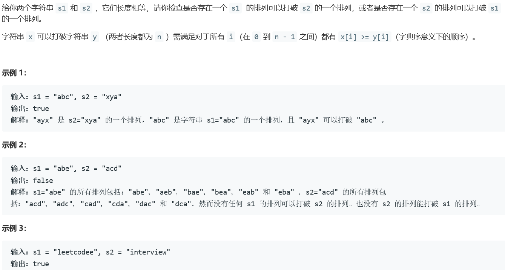
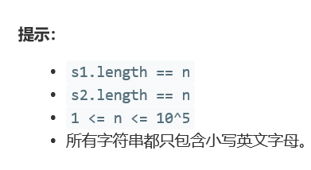

### 5386. 检查一个字符串是否可以打破另一个字符串


  

    

## Java solution
```java
class Solution {
    public boolean checkIfCanBreak(String s1, String s2) {
        char[] c1=s1.toCharArray();
        char[] c2=s2.toCharArray();
        Arrays.sort(c1);
        Arrays.sort(c2);
        boolean flag1=true;
        boolean flag2=true;
        for(int i=0;i<c1.length;i++)
        {
            if(c1[i]>c2[i])flag1=false;
            if(c1[i]<c2[i])flag2=false;
        }
        return flag1||flag2;
    } 
}

```