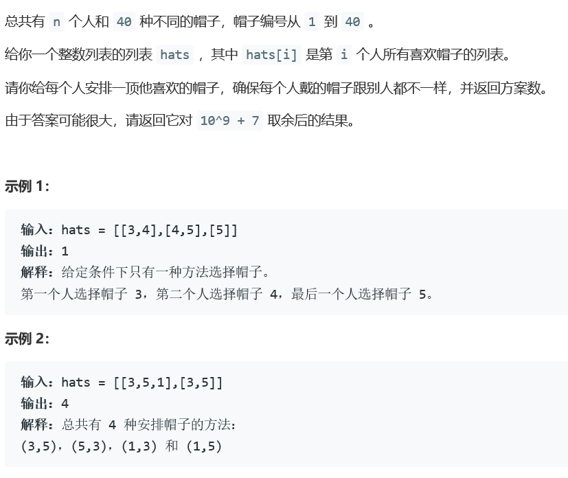
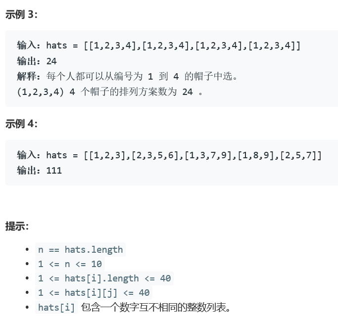

### 5387. 每个人戴不同帽子的方案数

  




## Java solution
```java
class Solution {
    int N=50;
    int M=2000;
    int MOD=(int)1e9+7;
    public int numberWays(List<List<Integer>> hats) {
       int n=hats.size();
       boolean[][] isValid=new boolean[N][n];//isvalid[i][j] 表示第j个人是否喜欢第i个帽子
       int[][] dp=new int[N][M];//dp[i][state]  分配完第i个帽子之后 状态为state state是一个n位的2进制数 第i位 1代表代表弟i个人被分配到了帽子 0代表没有分配到  --对应的方案数
       for(int i=0;i<n;i++)
       {
           List<Integer> hat=hats.get(i);
           for(Integer h:hat)
           {
               isValid[h][i]=true;
           }
       }
       dp[0][0]=1;//一个帽子也没有分配 对应所有人都没有帽子 方案数有一种
       int m=1<<n;
       //以下按照第一个帽子到第40个帽子一次分配的过程模拟
       //由于帽子是依次分配的 所以不存在冲突的问题(两个人有相同的帽子)
       for(int h=1;h<=40;h++)
       {
          for(int state=0;state<m;state++)
          {
              //对于相同状态 当前帽子h可以选择谁都不分配 这样dp[h][state]+=dp[h-1][state]
              dp[h][state]=(dp[h][state]+dp[h-1][state])%MOD;
              for(int i=0;i<n;i++)
              {
                  //(state&(1<<i))!=0 表示state第i位为1 第h个帽子分配给第i个人
                  if((state&(1<<i))!=0&&isValid[h][i])
                  {
                      //dp[h-1][state^(1<<i)] 将state第i位置为0 代表在分配完第h-1个帽子之后 第i个人还没有得到帽子
                      dp[h][state]=(dp[h][state]+dp[h-1][state^(1<<i)])%MOD;
                  }
              }
          }
       }
       return dp[40][m-1];
    }
}
```