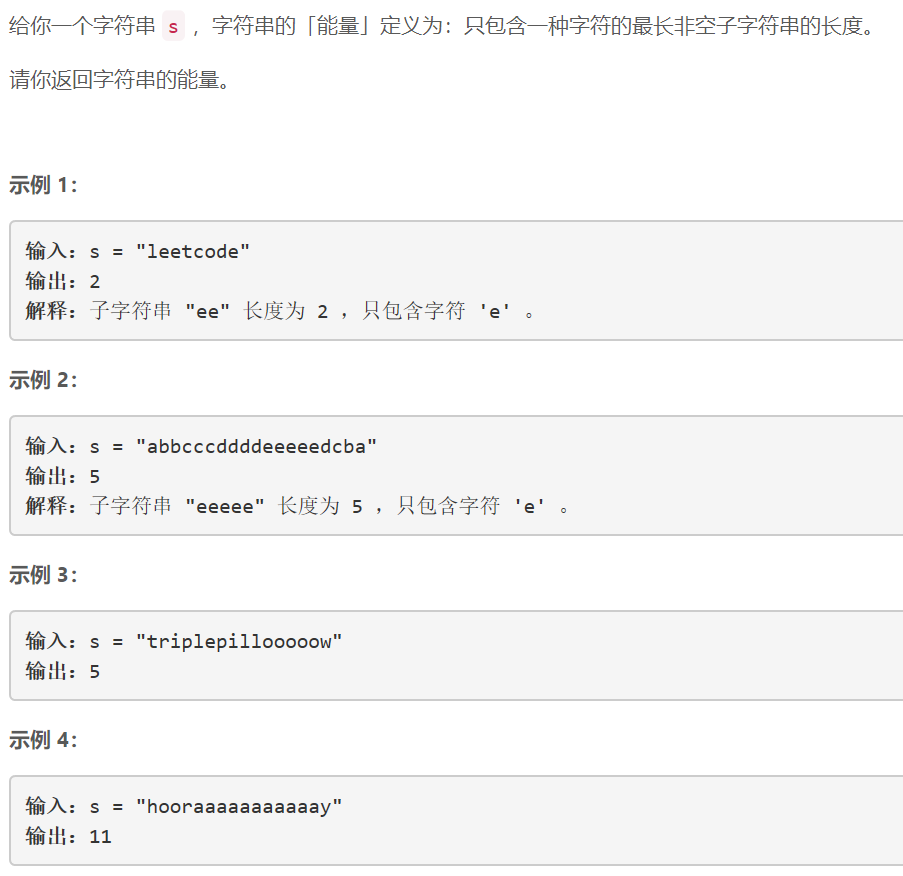
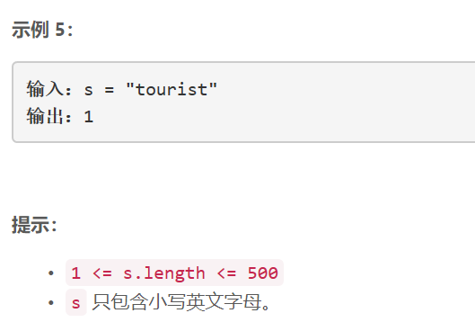

### 5396. 连续字符


    

  


## Java solution
```java
class Solution {
    public int maxPower(String s) {
        int cnt=0;
        char[] str=s.toCharArray();
        int i=0;
        for(;i<str.length;++i)
        {
            int j=i;
            while(i<str.length-1 && str[i]==str[i+1])++i;
            cnt=Math.max(i-j+1,cnt);
        }
        return cnt;
    }
}
```