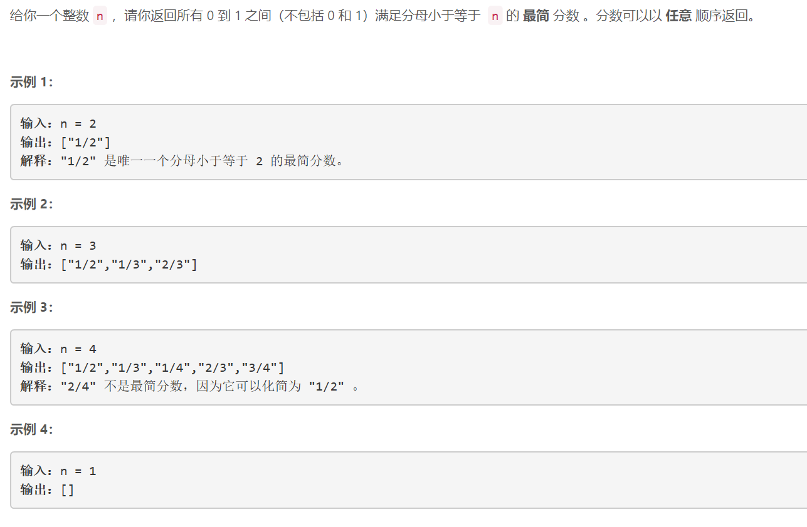
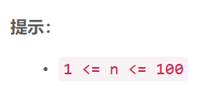

### 5397. 最简分数

### 

###   




## Java solution
```java
class Solution {
    public List<String> simplifiedFractions(int n) {
         Set<Float> s=new HashSet<>();
        List<String> res=new ArrayList<>();
        for(int i=2;i<=n;i++)
        {
            for(int j=1;j<i;j++)
            {
                if(!s.contains((float)j/i))
                {
                    res.add(j+"/"+i);
                    s.add((float)j/i);
                }
                
            }
        }
        return res;
    }
}
```


