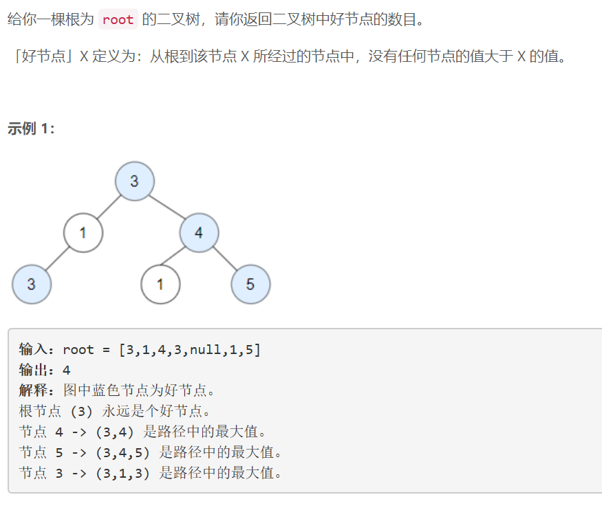
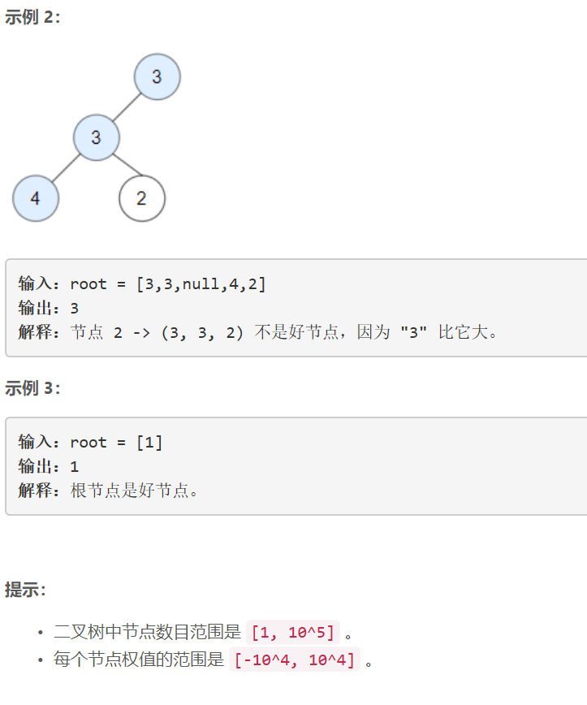

### 5398. 统计二叉树中好节点的数目


  

    

## Java solution
```java
/**
 * Definition for a binary tree node.
 * public class TreeNode {
 *     int val;
 *     TreeNode left;
 *     TreeNode right;
 *     TreeNode() {}
 *     TreeNode(int val) { this.val = val; }
 *     TreeNode(int val, TreeNode left, TreeNode right) {
 *         this.val = val;
 *         this.left = left;
 *         this.right = right;
 *     }
 * }
 */
class Solution {
    int cnt=0;
    public int goodNodes(TreeNode root) {
        if(root==null) return 0;
        helper(root,root.val);
        return cnt;
    }
    private void helper(TreeNode root,int curMax)
    {
        if(root==null) return;
        if(root.val>=curMax)cnt++;
        helper(root.left,Math.max(curMax,root.val));
        helper(root.right,Math.max(curMax,root.val));
    }
}

```