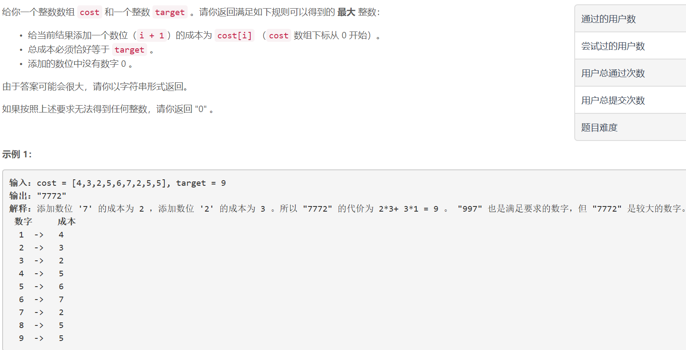
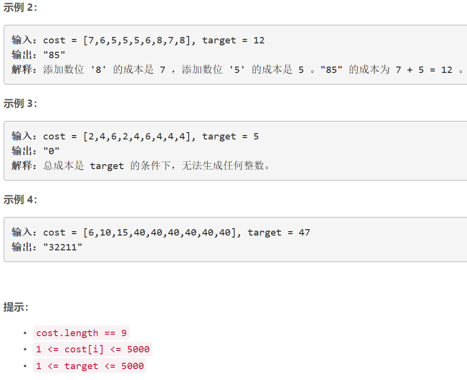

### 5399. 数位成本和为目标值的最大数字

  




## Java solution
```java
class Solution {
    String[] dp=new String[5005];//dp[cost] 表示花费cost时最大的number的string形式
    public String largestNumber(int[] cost, int target) {
        for(int i=0;i<=target;i++)dp[i]="";
        for(int j=0;j<9;j++)
            if(cost[j]<=target)
               if(dp[cost[j]].length()==0 || Integer.valueOf(dp[cost[j]])<(j+1))
               dp[cost[j]]=(j+1)+"";
        for(int i=1;i<target;i++)
        {
            for(int j=0;j<9;j++)
            {
                if(dp[i].length()==0 || i+cost[j]>target) continue;
                String cur=dp[i]+(j+1);
                if(cmp(cur,dp[i+cost[j]]))dp[i+cost[j]]=cur;
            }
        }
        if(dp[target].length()==0) return "0";
        char[] res=dp[target].toCharArray();
        Arrays.sort(res);
        return new StringBuffer(String.valueOf(res)).reverse().toString();//降序排列
           
    }
    private boolean cmp(String s1,String s2)//s1>s2 返回true s1<=s2 返回false
    {
        if(s1.length()<s2.length()) return false;
        if(s1.length()>s2.length()) return true;
        char[] c1=s1.toCharArray();
        char[] c2=s2.toCharArray();
        //由于在添加数字的时候 实际上会遍历所有可能的情况 也就是说 48和84的cost相同 所以一定会做比较 所以无需排序
        for(int i=c1.length-1;i>=0;i--)
        {
            if(c1[i]>c2[i]) return true;
            if(c1[i]<c2[i]) return false;
        }
        return false;
    }
}
```