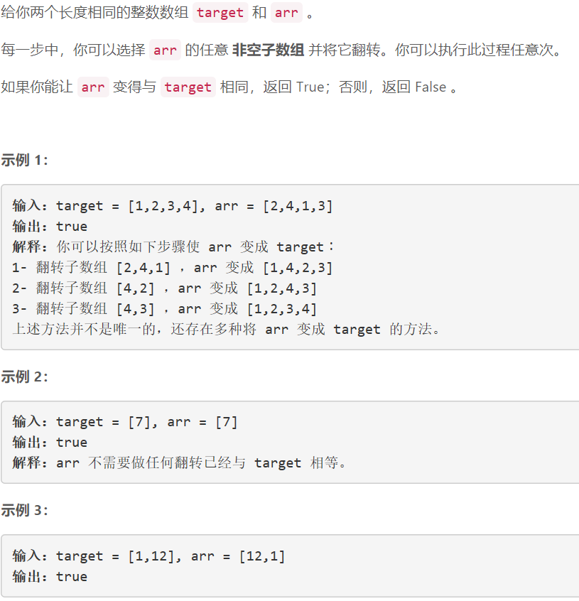
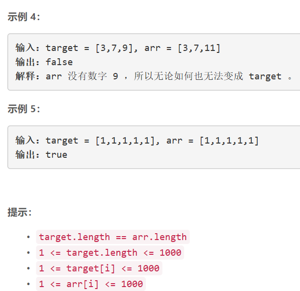

### 5408. 通过翻转子数组使两个数组相等


    

  


## Java solution
```java
class Solution {
    
    public boolean canBeEqual(int[] target, int[] arr) {
         int[] dp1=new int[1005];
         int[] dp2=new int[1005];
         for(int i:target)dp1[i]++;
         for(int i:arr)dp2[i]++;
         for(int i=0;i<1005;i++)
         {
             if(dp1[i]!=dp2[i])return false;
         }
         return true;
    }
}
```