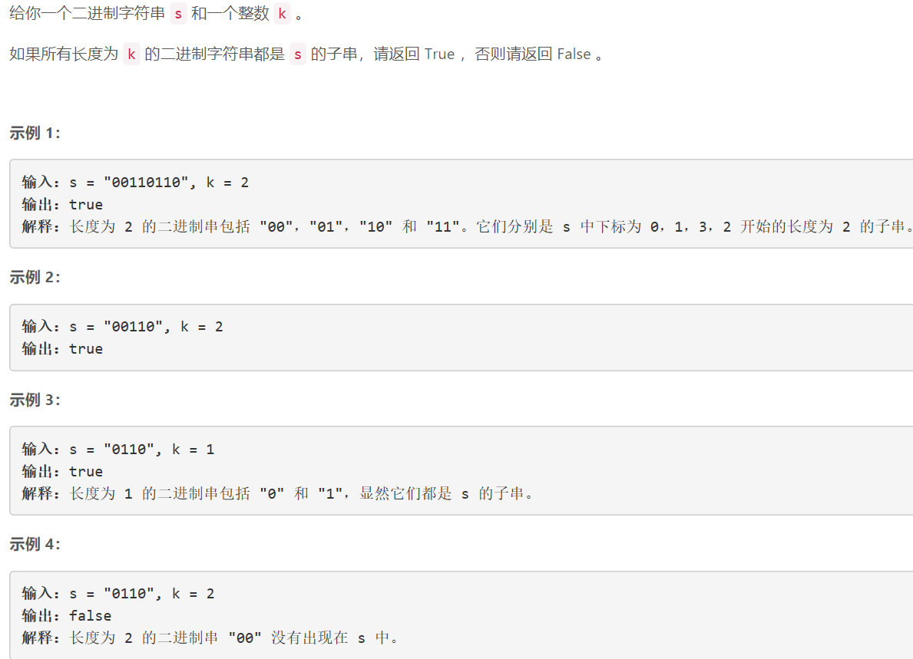
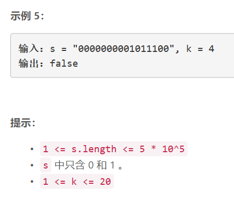

### 5409. 检查一个字符串是否包含所有长度为 K 的二进制子串

### 

###   




## Java solution
```java
class Solution {
    public boolean hasAllCodes(String s, int k) {
         int upper=1<<k;
         int len=s.length();
         boolean[] dp=new boolean[upper];
         for(int i=k;i<=len;i++)
         {
             int num=toInteger(s.substring(i-k,i));
             dp[num]=true;
         }
         for(int i=0;i<upper;i++)
         {
             if(!dp[i]) return false;
         }
         return true;
    }
    private int toInteger(String s)
    {
        int res=0;
        for(char c:s.toCharArray())
        {
            int bit=c=='1'?1:0;
            res=res*2+bit;
        }
        return res;
    }
}
```


