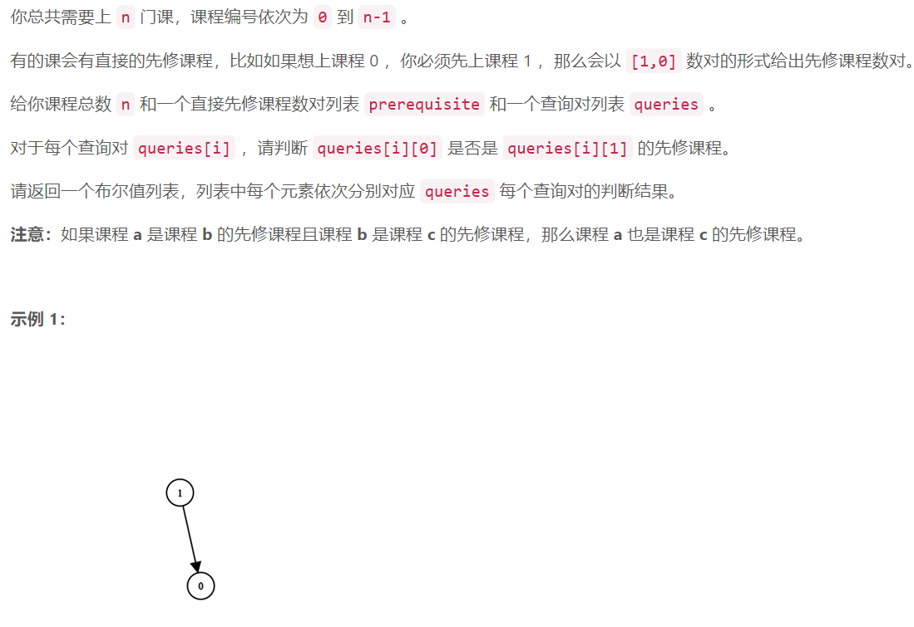
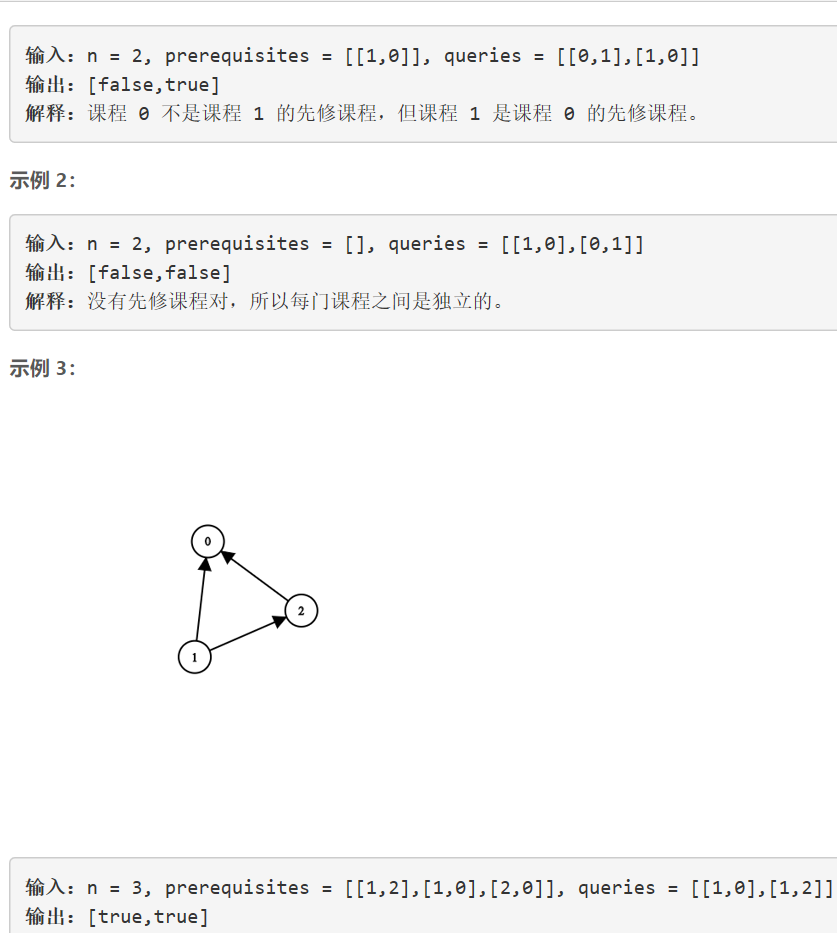
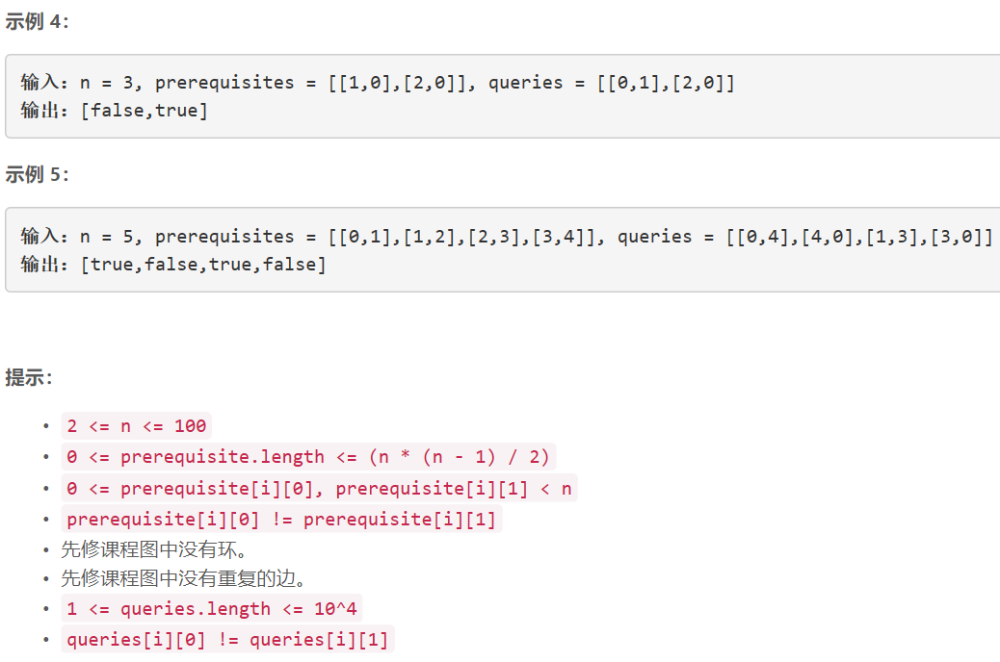

### 5410. 课程安排 IV


  

    



## Java solution

```java
class Solution {
    List<Set<Integer>> l=new ArrayList<>();
    public List<Boolean> checkIfPrerequisite(int n, int[][] prerequisites, int[][] queries) {
         List<Boolean> res=new ArrayList<>();
         for(int i=0;i<n;i++) l.add(new HashSet<>());  
         int len=prerequisites.length;
         for(int i=0;i<len;i++)
         {
             dfs(prerequisites[i][0],new boolean[n],prerequisites[i][1]);
             
         }
        len=queries.length;
        for(int i=0;i<len;i++)
        {
            Set<Integer> cur=l.get(queries[i][1]);
            boolean now=cur.contains(queries[i][0])? true:false;
            res.add(now);
        }
        return res;
    }
    private void dfs(int index,boolean[] visited,int now)
    {
        l.get(now).add(index);
        Set<Integer> cur=l.get(index);
        visited[index]=true;
        for(Integer next:cur) {
            if(visited[next])continue;
            dfs(next,visited,now);
        }
    }
}

```