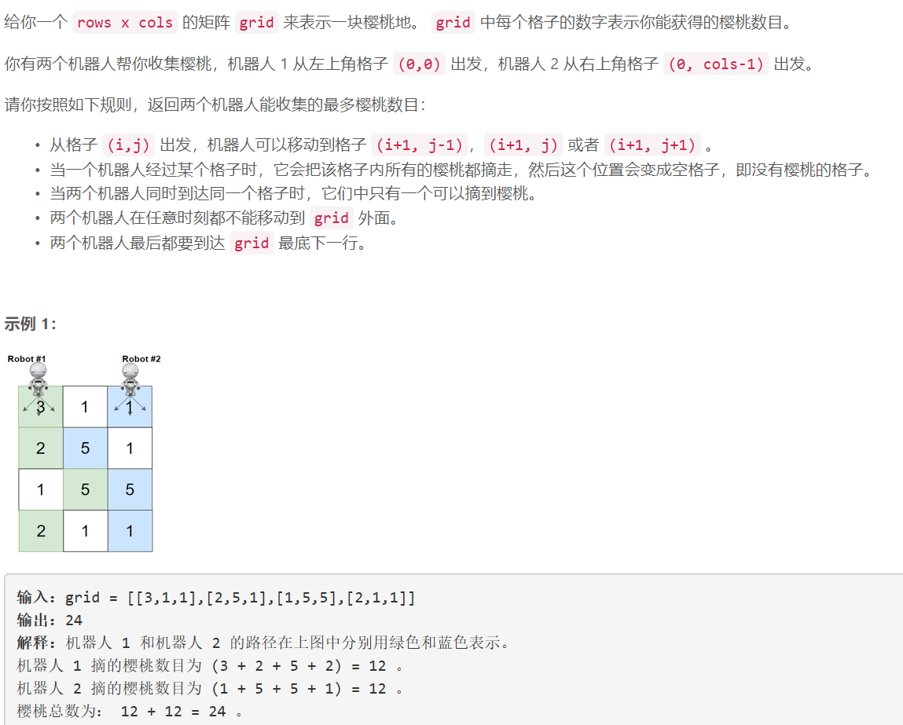
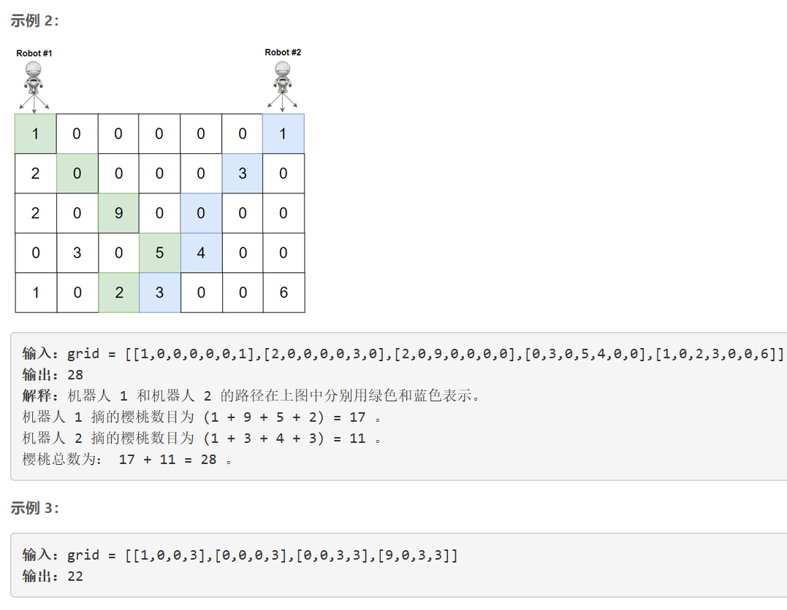
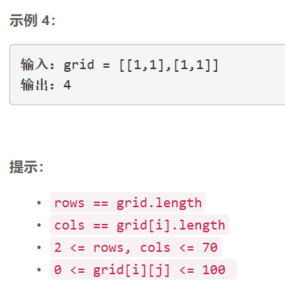

### 5411. 摘樱桃 II

  






## Java solution
```java
class Solution {
    int[][][] dp=new int[75][75][75]; //dp[i][j][k] 表示grid第i行第一个机器人运动到第j列 第二个机器人运动到第k列 所能采集到的最大樱桃数目 
    public int cherryPickup(int[][] grid) {
       int m=grid.length,n=grid[0].length; 
       int res=0;
       for(int i=0;i<75;i++)for(int j=0;j<75;j++) for(int k=0;k<75;k++) dp[i][j][k]=-1;//将dp所有位置先置为-1
       dp[0][0][n-1]=grid[0][0]+grid[0][n-1];//dp中只有在特定位置才不为0--符合路径要求
       for(int i=1;i<m;i++) for(int j=0;j<n;j++) for(int k=0;k<n;k++)if(dp[i-1][j][k]>=0)
           for(int dy1=-1;dy1<=1;dy1++) 
           {
               int y1=j+dy1;
               if(y1>=0 && y1<n)
                 for(int dy2=-1;dy2<=1;dy2++)
                 {
                     int y2=k+dy2;
                     
                     if(y2>=0 && y2<n)
                     {
                         dp[i][y1][y2]=Math.max(dp[i][y1][y2],dp[i-1][j][k]+grid[i][y1]+(y1==y2?0:grid[i][y2]));
                     }
                 }
           }
       for(int i=0;i<n;i++)
       {
           for(int j=0;j<n;j++)
           {
               res=Math.max(res,dp[m-1][i][j]);
           }
       }
        return res;
    }
}
```