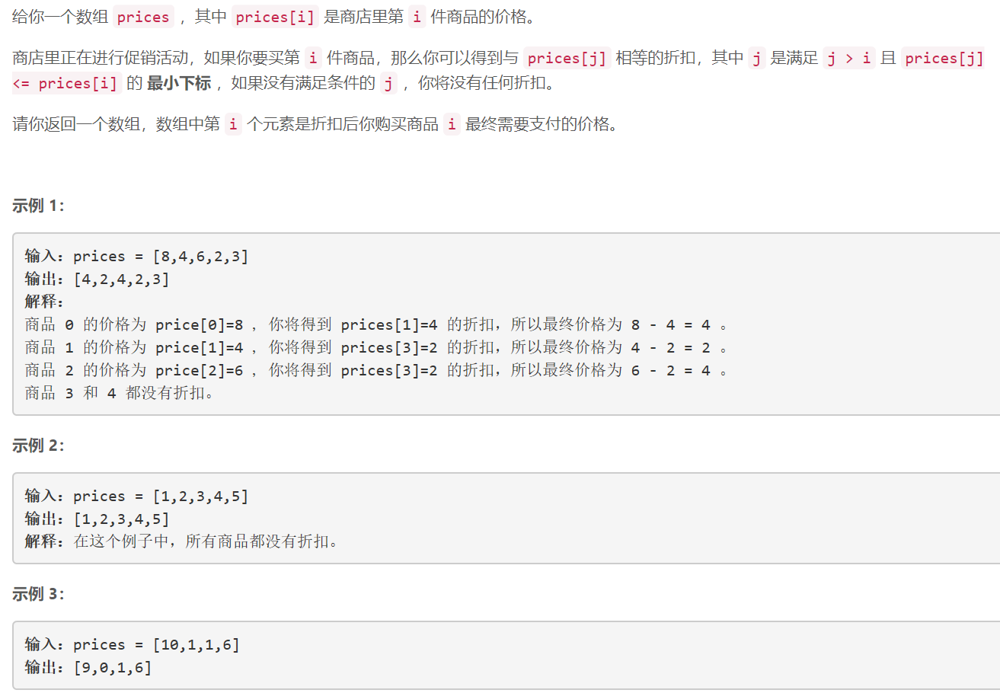
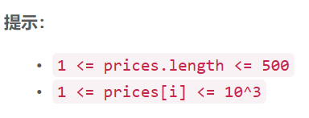

### 1475. 商品折扣后的最终价格

### 

###   




## Java solution
```java
class Solution {
    public int[] finalPrices(int[] prices) {
       int n=prices.length; 
        int[] res=new int[n];
       for(int i=0;i<n;i++)
       {
           int minus=0;
           for(int j=i+1;j<n;j++)
           {
               if(prices[i]>=prices[j])
               {
                   minus=prices[j];
                   break;
               }
           }
           res[i]=prices[i]-minus;
       }
        return res;
    }
}
```


