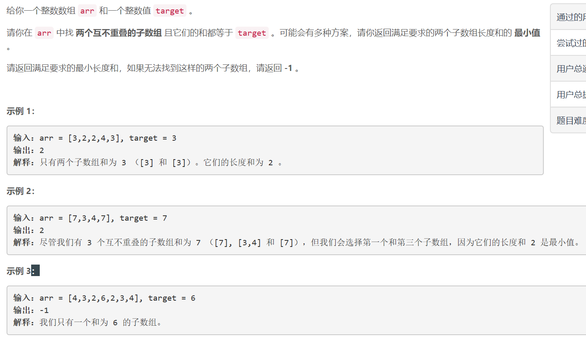
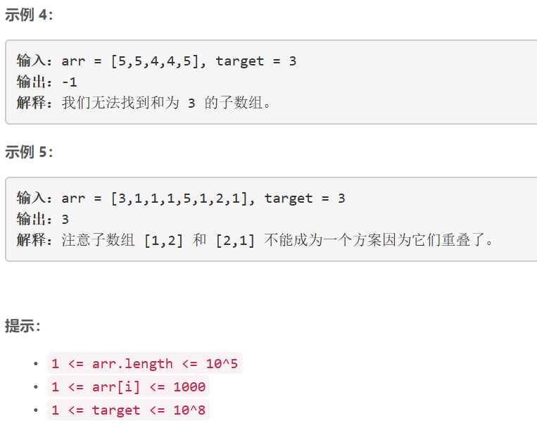

### 1477. 找两个和为目标值且不重叠的子数组


  

    

## Java solution

```java
class Solution {
    int MAX=100005;
    int res=MAX;
    public int minSumOfLengths(int[] arr, int target) { 
        int n=arr.length;
        Queue<Integer> q=new LinkedList<>();
        int sum=arr[0];
        int[] dp1=new int[n+1];
        int[] dp2=new int[n+1];
        for(int i=0;i<n;i++)
        {
            dp1[i]=MAX;
            dp2[i]=MAX;
        }
        q.offer(arr[0]);
        for(int i=1;i<=n;i++)
        {
            while(sum>target)
            {
                sum-=q.peek();
                q.poll();
            }
            if(sum==target)
            {
                dp1[i]=Math.min(dp1[i-1],q.size());
            }
            else dp1[i]=dp1[i-1];
            if(i>n-1)break;
            q.offer(arr[i]);
            sum+=arr[i];
        }
        
        q=new LinkedList<>();
        sum=arr[n-1];
        q.offer(arr[n-1]);
        for(int i=n-2;i>=0;i--)
        {
            while(sum>target)
            {
                sum-=q.peek();
                q.poll();
            }
            if(sum==target)
            {
                dp2[i]=Math.min(dp2[i+1],q.size());
            }
            else dp2[i]=dp2[i+1];
            if(i<0)break;
            q.offer(arr[i]);
            sum+=arr[i];
        } 
        for(int i=1;i<n;i++)
        {
            res=Math.min(res,dp1[i]+dp2[i-1]);
        }
        
        return res==MAX?-1:res;
    }
  

}
```