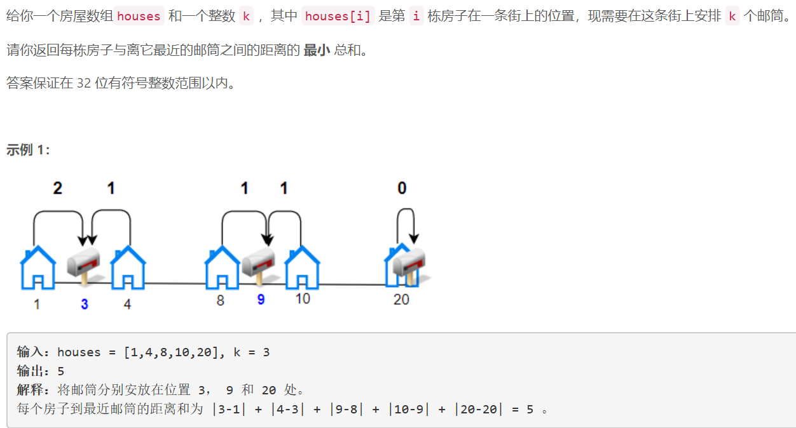
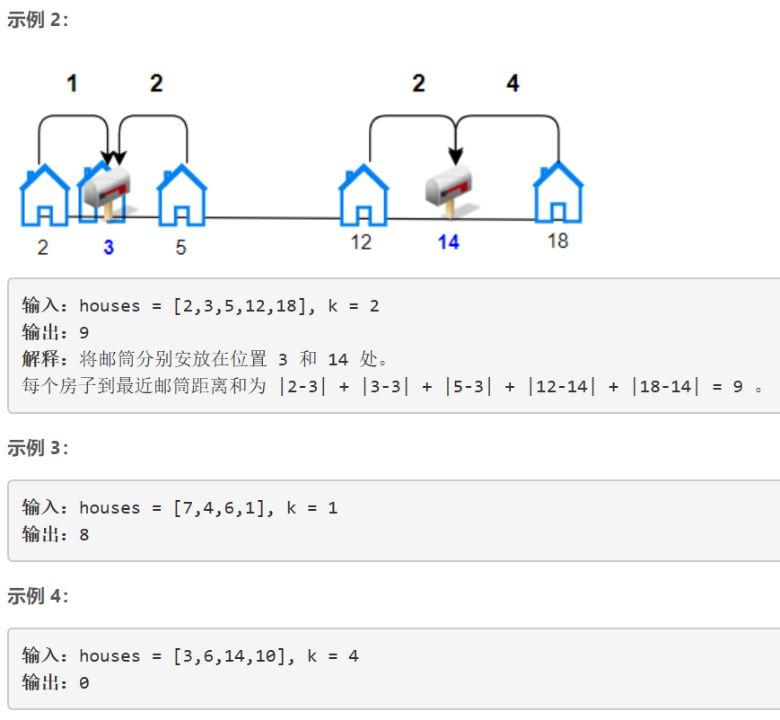
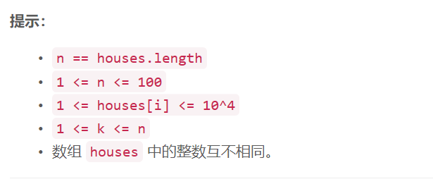

### 1478. 安排邮筒

  






## Java solution
```java
class Solution {
    long[][] dis=new long[105][105];//dis[i][j] 表示house[i]和house[j]之间设置一个邮局的最小距离和
    long[][] dp=new long[105][105];//dp[i][t] 表示一共i个house,t个邮局 最小的距离和
    public int minDistance(int[] houses, int k) {
        int n=houses.length;
        Arrays.sort(houses);
        for(int i=1;i<=n;i++)
        {
            for(int j=i;j<=n;j++)
            {
                //将邮局设置到house[i]和house[j]的中间位置距离和最小
                int mid=i+((j-i)>>1);
                //System.out.print(i+" "+j+" "+mid+"\n");
                int pos=houses[mid-1];
                dis[i][j]=0;
                for(int m=i;m<=j;m++)
                {
                    dis[i][j]+=Math.abs(houses[m-1]-pos);
                }
            }
        }
        for(int i=0;i<=n;i++)for(int t=0;t<=k;t++) dp[i][t]=Integer.MAX_VALUE;
        dp[0][0]=0;
        for(int i=1;i<=n;i++)
        {
           for(int t=1;t<=i && t<=k;t++)
           {
               for(int j=i-1;j>=0;j--)
               {
                   //dp[j][t-1]表示前j个house,t-1个邮局的最小距离和
                   //dis[j+1][i]表示房屋j到房屋i-1之间放置一个邮局的最小距离
                   dp[i][t]=Math.min(dp[i][t],dp[j][t-1]+dis[j+1][i]);
               }
           }
        }

        return (int)dp[n][k];
    }
}
```