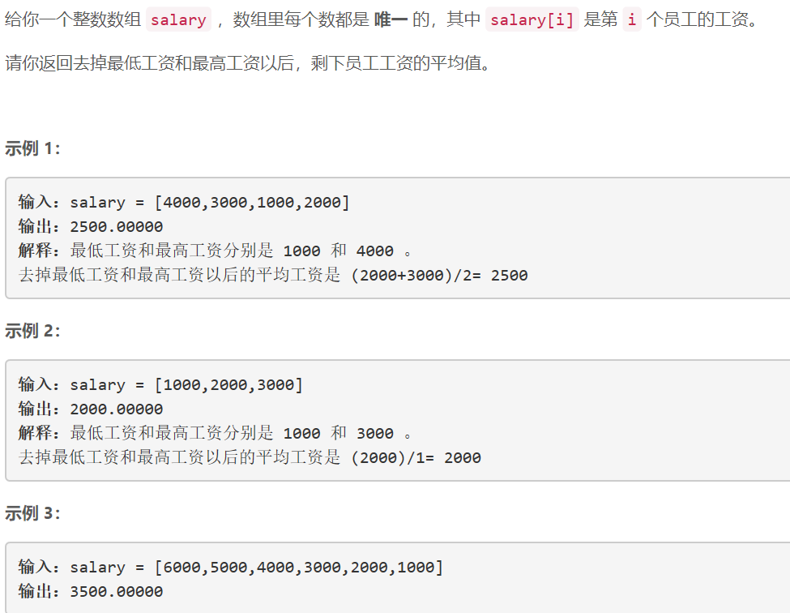
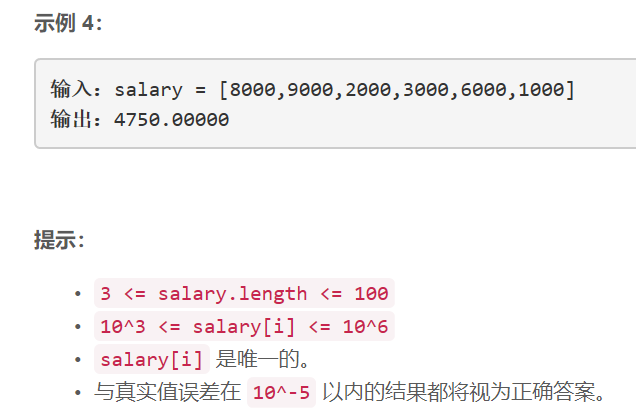

### 5432. 去掉最低工资和最高工资后的工资平均值

### 

###   




## Java solution
```java
class Solution {
    public double average(int[] salary) {
       int max=salary[0],min=salary[0];
       int sum=0; 
       int n=salary.length-2; 
       for(int s:salary)
       {
           sum+=s;
           max=Math.max(s,max);
           min=Math.min(s,min);
       }
       return 1.0*(sum-max-min)/n; 
    }
}
```


