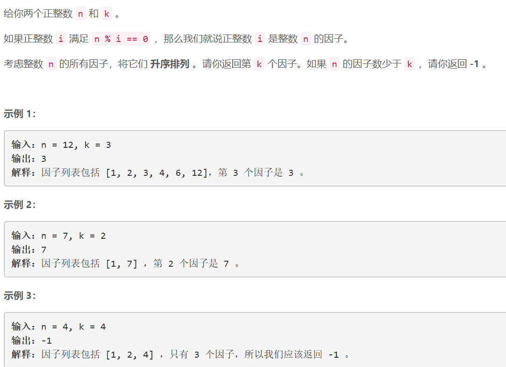
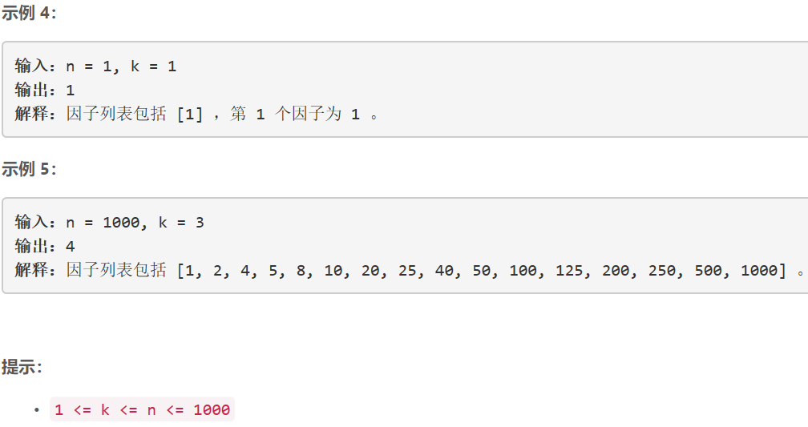

### 5433. n 的第 k 个因子


    

  


## Java solution
```java
class Solution {
    public int kthFactor(int n, int k) {
        int upper_bound=(int)Math.sqrt(n)+1;
        List<Integer> list=new ArrayList<>();
        for(int i=1;i<upper_bound;i++)
        {
            if(n%i==0) 
            {
                list.add(i);
                if(n/i!=i)list.add(n/i);
            }
        }
        if(k>list.size()) return -1;
        Collections.sort(list);
        return list.get(k-1);
    }
}
```