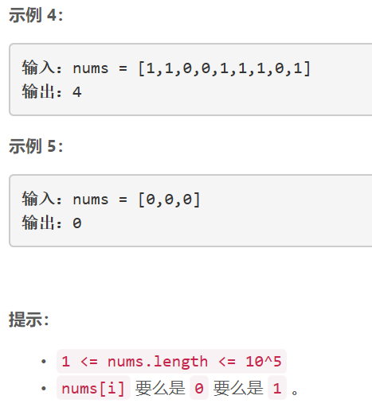

### 5434. 删掉一个元素以后全为 1 的最长子数组


  

    

## Java solution

```java
class Solution {
    public int longestSubarray(int[] nums) {
        int i=0;
        int n=nums.length;
        int max_len=0;
        List<Integer> cnt=new ArrayList<>();
        List<Boolean> isZero=new ArrayList<>();
        boolean flag=false;
        while(i<n)
        {
            int zero_cnt=0,one_cnt=0;
            while(i<n&&nums[i]==0)
            {
                zero_cnt++;
                i++;
            }
            if(zero_cnt!=0)
            {
                flag=true;
                cnt.add(zero_cnt);
                isZero.add(true);
            }
            while(i<n&&nums[i]==1)
            {
                one_cnt++;
                i++;
            }
            if(one_cnt!=0)
            {
                cnt.add(one_cnt);
                isZero.add(false);
            }
        }
        int pre=0;
        for(int j=0;j<cnt.size();j++)
        {
            if(isZero.get(j))
            {
                max_len=Math.max(pre,max_len);
                if(cnt.get(j)>1)pre=0;
            }
            else
            {
                max_len=Math.max(pre+cnt.get(j),max_len);
                pre=cnt.get(j);
            }
        }
        return flag ? max_len:max_len-1;
    }
}
```