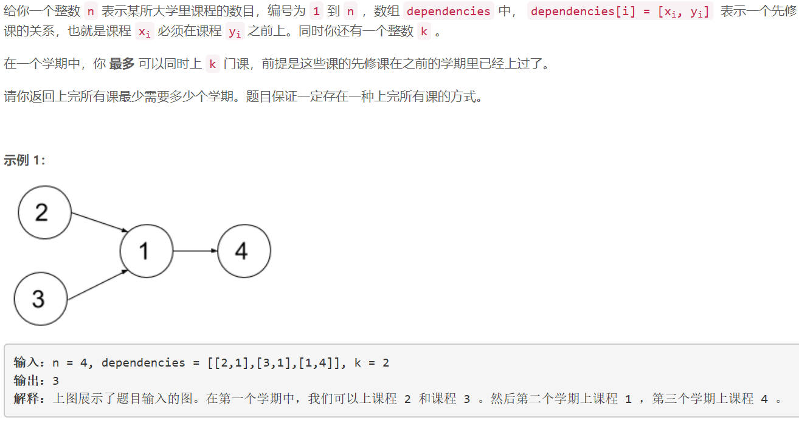
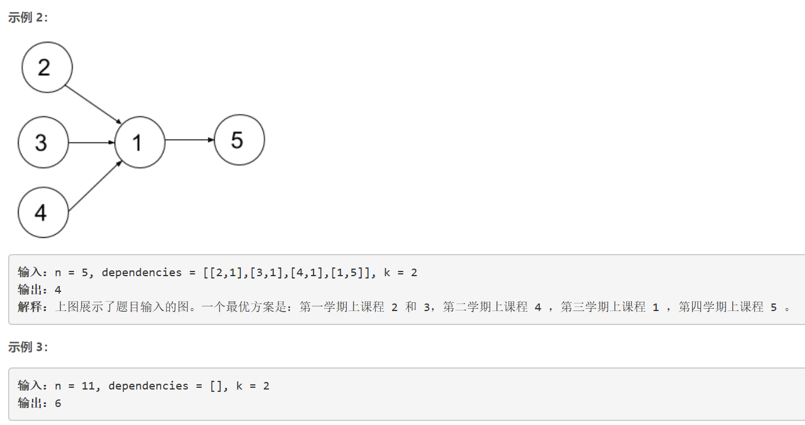
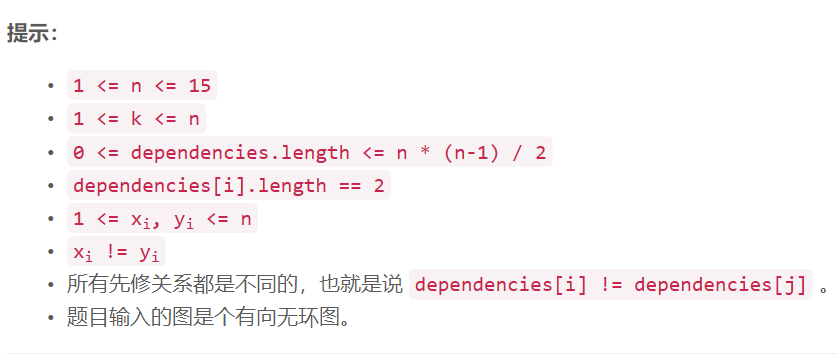

### 5435. 并行课程 II

  






## Java solution
```java
class Solution {
    int[] mask=new int[15];
    int[] dp=new int[1<<15];
    int[] cnt=new int[1<<15];
    //dp[state] 表示上完状态为state的课程需要多少学期 state第n位为1 则说明课程n已经上过了
   //state第n位为0 则说明课程n还没上过
    //mask[i]  表示课程i需要先修课程的掩码  mask[i]第j位为1说明 第j门课是i的先修课程 为0 则说明第j门课不是i的先修课程
    //cnt[state] 表示状态state中1的个数 也就是state下已完成课程的数目
    public int minNumberOfSemesters(int n, int[][] dependencies, int k) {
        int N=1<<n;
        for(int i=0;i<n;i++) mask[i]=0;
        //只需记录上一级的先修课程 先修课程的先修课程不需要记录
        //因为只有先修课程的先修课程上完 先修课程才能上
        for(int[] d:dependencies) mask[d[1]-1] |=1<<(d[0]-1);
        cnt[0]=0;
        for(int i=1;i<N;i++) cnt[i]=cnt[i>>1]+(i&1);
        for(int i=1;i<N;i++) dp[i]=16; //天数最多为15
        dp[0]=0;
        for(int i=0;i<N;i++)
        {
            if(dp[i]<=n) //上完所有课最多需要n学期 如果dp[i]>n 说明i状态无法达到
            {
                //System.out.print(i+" ");
              // i为所有课程的完成状态 j为课程序号  
              //(i>>j& 0x1)==0 表示i的第j位不是1说明 该课程还没有上
              //(mask[j] & i) == mask[j] 说明课程j的先修课程已经上完(i中对应mask[j]所有为1的bit也为1) 
              //上述条件满足的情况下 将cur的第j位置1 说明该课程可以在当前学期完成
              int cur=0;
              for(int j=0;j<n;j++)
              {
                  if( (i>>j& 0x1)==0 && (mask[j] & i) == mask[j] ) cur|=1<<j;
              }
              System.out.print(i+" "+cur+"\n");
              //l中包括了当前学期内所有可以完成的课程 其中的课程可以选择在本学期完成 也可以不在
             // j-1 & l 表示逐步将l中的1从低位开始 每次迭代减少一个(课程)
             //当前状态j中的课程数o[j]小于k 说明可以在本学期完成 因此将j中课程加入原始状态i( i|j )
             //dp[i]+1 表示学习天数增加一天
              for(int j=cur;j!=0;j=j-1&cur)
              {
                if(cnt[j]<=k) dp[i|j]=Math.min(dp[i|j],dp[i]+1);
              }
            }
        }
        return dp[N-1];
    }
}
```

