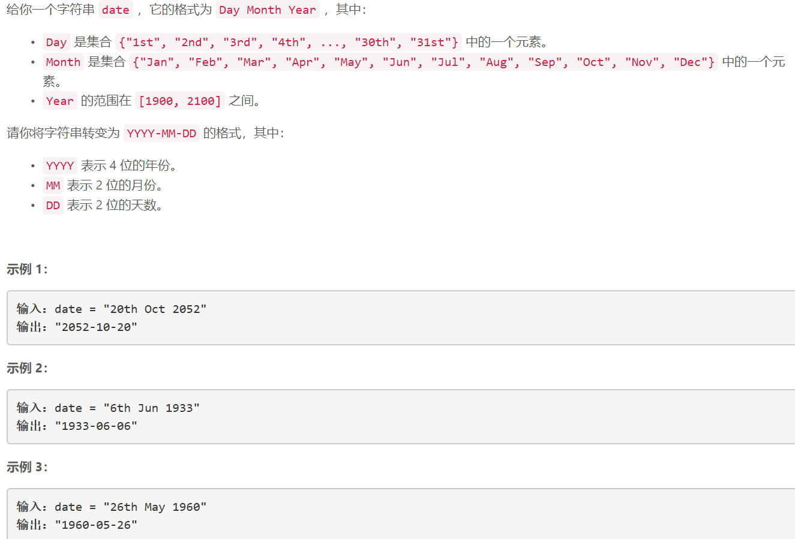

### 5177. 转变日期格式

### 


## Java solution
```java
class Solution {
    public String reformatDate(String date) {
        HashMap<String,String> map=new HashMap<>();
        map.put("Jan","01");
        map.put("Feb","02");
        map.put("Mar","03");
        map.put("Apr","04");
        map.put("May","05");
        map.put("Jun","06");
        map.put("Jul","07");
        map.put("Aug","08");
        map.put("Sep","09");
        map.put("Oct","10");
        map.put("Nov","11");
        map.put("Dec","12");
        String d="";
        String m="";
        String y="";
        int i=0;
        while(date.charAt(i)<='9' &&date.charAt(i)>='0' )d+=date.charAt(i++);
        i+=3;
        if(d.length()==1) d="0"+d;
        while(date.charAt(i)!=' ')m+=date.charAt(i++);
        ++i;
        m=map.get(m);
        while(i<date.length())y+=date.charAt(i++);
        return y+"-"+m+"-"+d; 
      }
}
```


