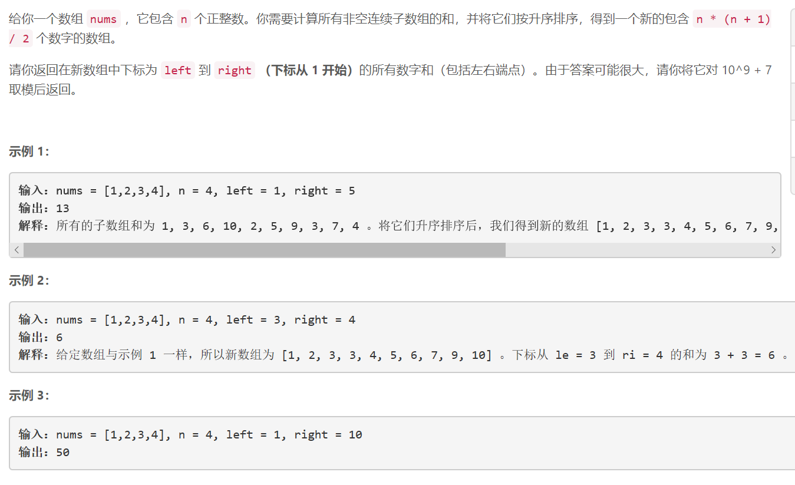
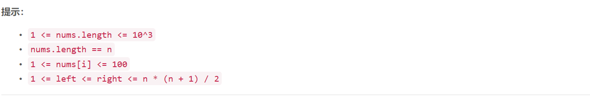

### 5445. 子数组和排序后的区间和


    

  


## Java solution
```java
class Solution {
    int mod=(int)1e9+7;
    public int rangeSum(int[] nums, int n, int left, int right) {
       List<Integer> l=new ArrayList<>();
       for(int i=0;i<n;i++)for(int j=i;j<n;j++)
       {
           if(j==i)l.add(nums[j]);
           else l.add(l.get(l.size()-1)+nums[j]);
       }
       
       Collections.sort(l); 
       int res=0; 
       for(int i=left;i<=right;i++)
       {
           res=(res+l.get(i-1))%mod;
       }    
       return res; 
    }
}
```