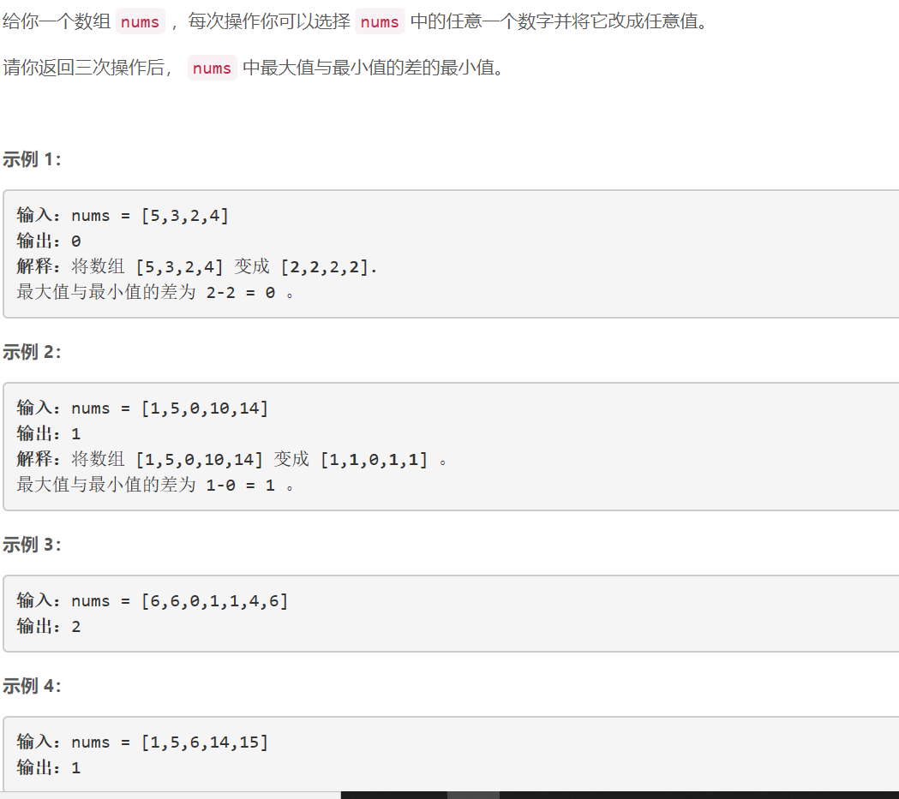
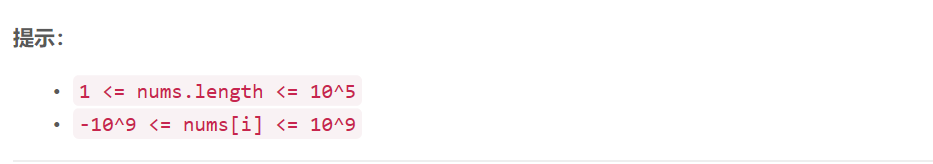

### 5446. 三次操作后最大值与最小值的最小差


  

    

## Java solution

```java
class Solution {
    public int minDifference(int[] nums) {
       int n=nums.length;
       if(n<=4) return 0;
       Arrays.sort(nums);
       int res=(int)1e9*2;
       for(int i=0;i<4;i++)res=Math.min(nums[n-1-(3-i)]-nums[i],res) ;
       return res; 
    }
}
```