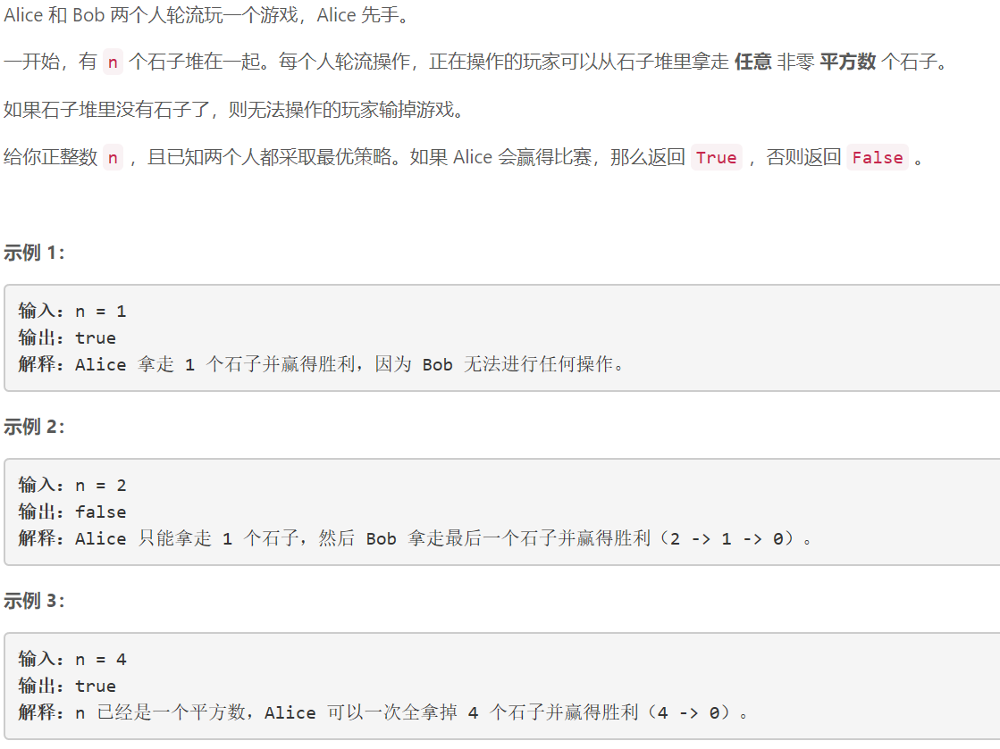
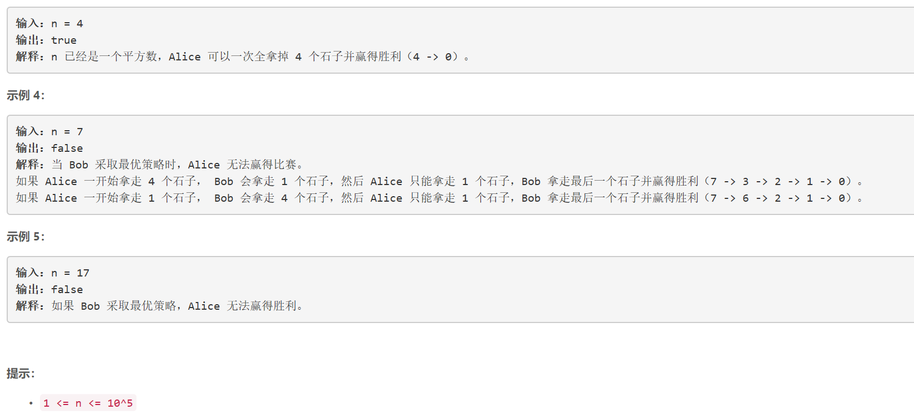

### 5447. 石子游戏 IV

  




## Java solution
```java
class Solution {
    public boolean winnerSquareGame(int n) {
       boolean[] dp=new boolean[1000000];
        for(int i=1;i<=n;i++){
            int j=1;
            while(j*j<=i){
                if(dp[i-j*j]==false)
                {  
                    dp[i]=true;
                    break;
                }
                j++;
            }
        }
        return dp[n];
    }
}
```

