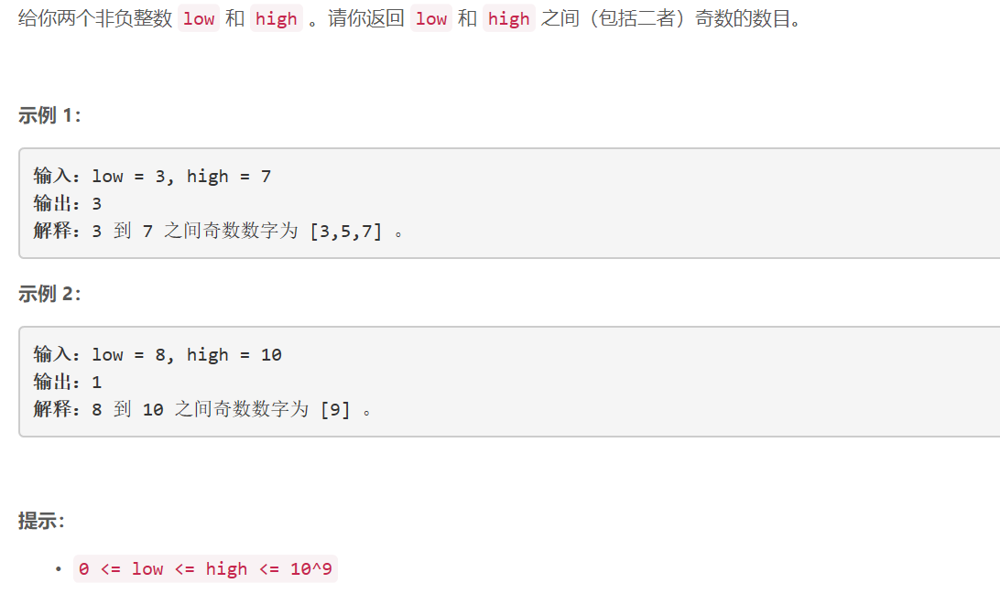

### 5456. 在区间范围内统计奇数数目

### 


## Java solution
```java
class Solution {
    public int countOdds(int low, int high) {
       //一共high-low+1=n个数 b=n%2 如果个数数目为奇书--hogh和low全部为奇数那么返回b+1 否则返回b  
       return ((high-low+1)>>1)+((low%2==1&&high%2==1)?1:0);
    }
}
```


